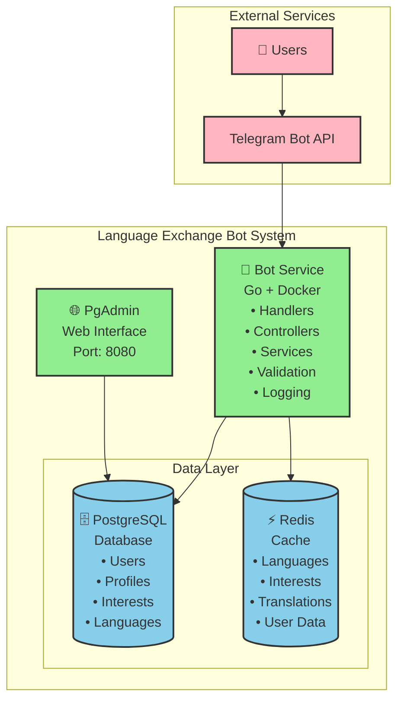
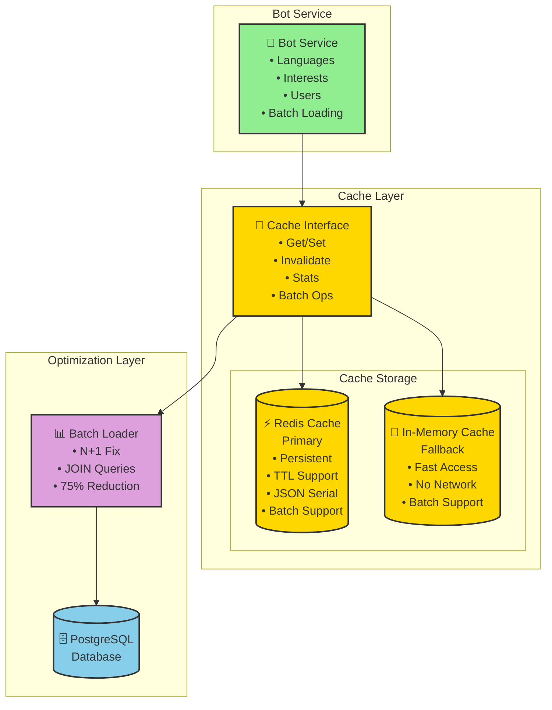
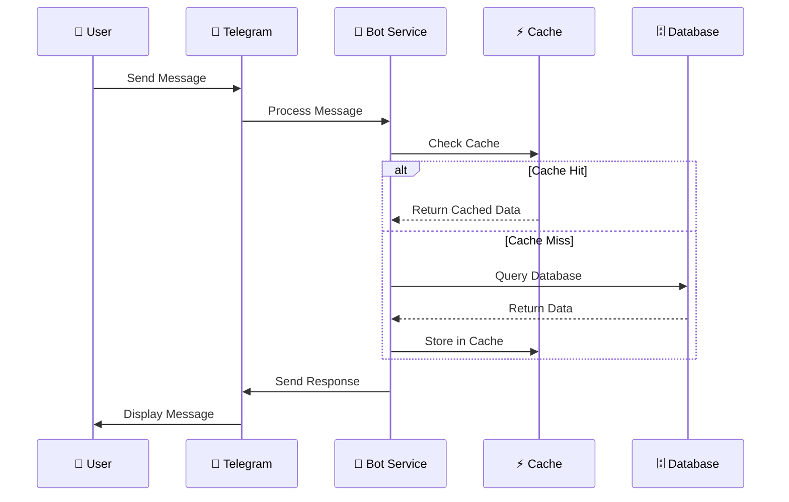
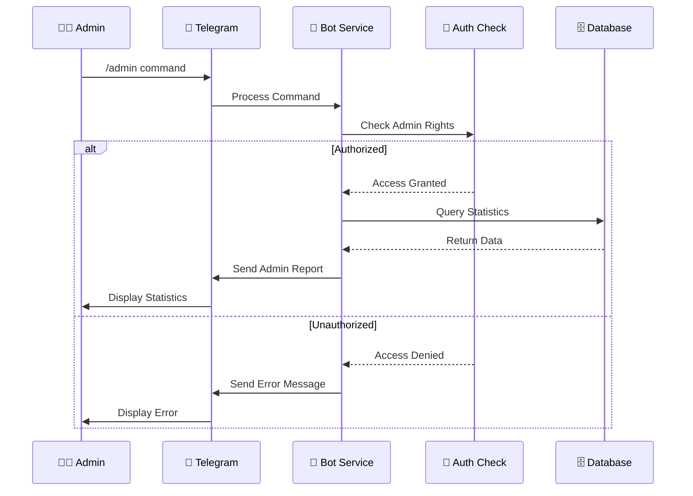
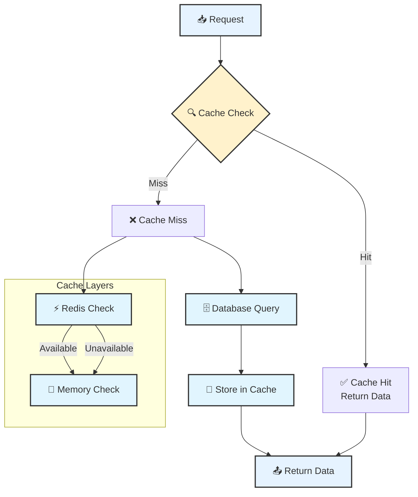
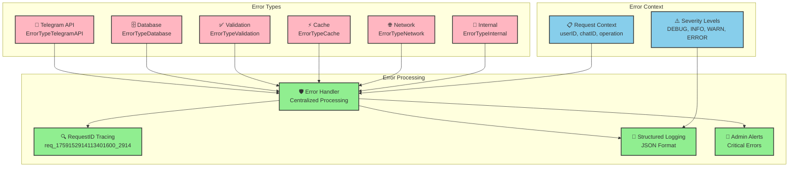
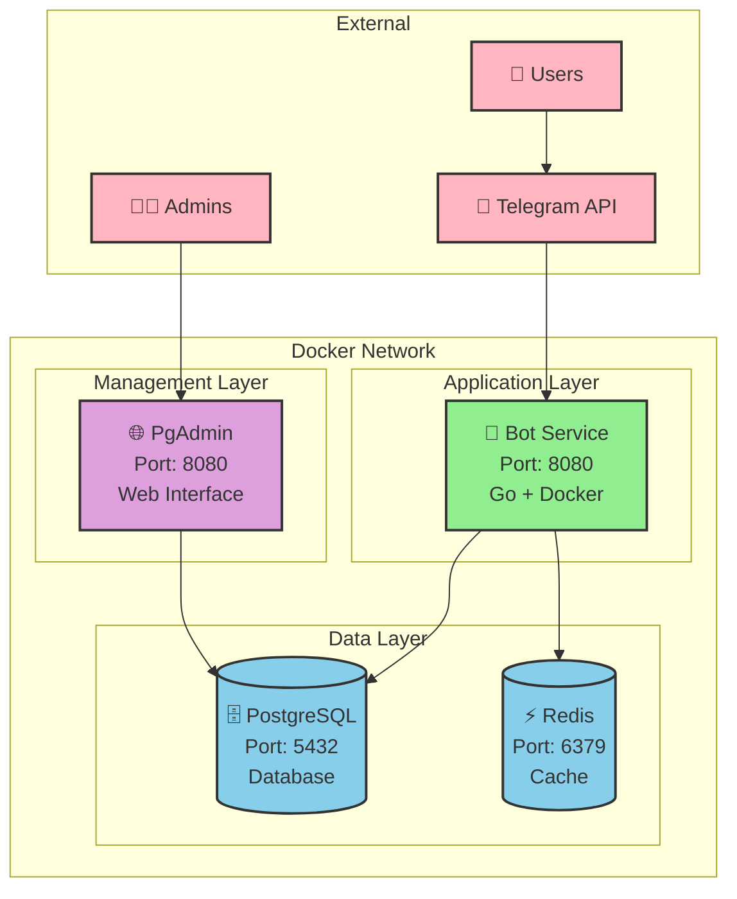
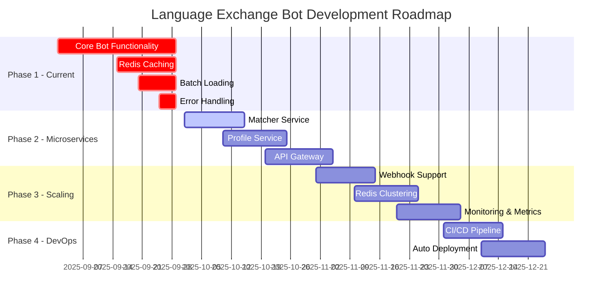
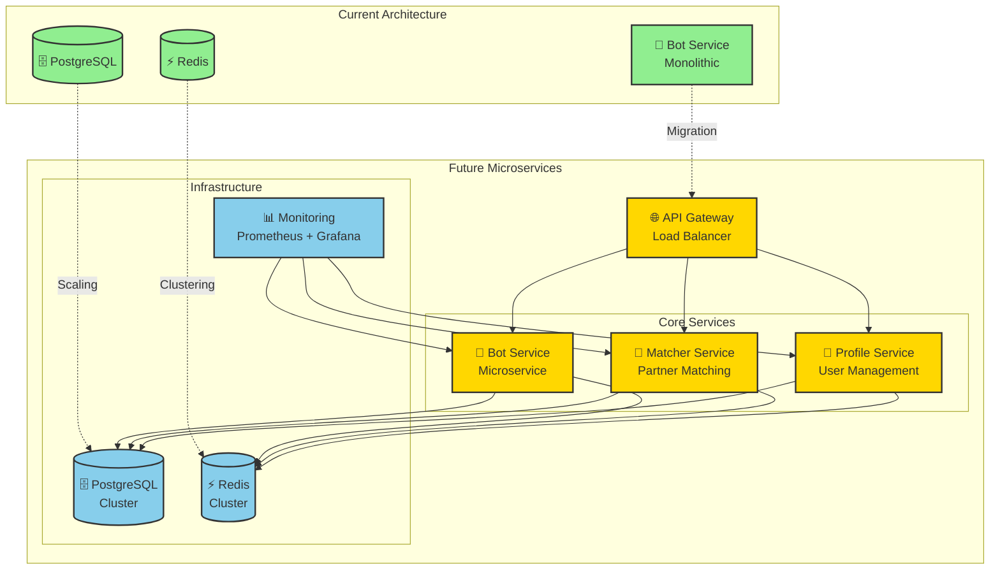

# Архитектура Language Exchange Bot

## 🏗️ Общая архитектура системы



## 🔧 Текущая архитектура (Упрощенная)

### Активные компоненты

#### 🤖 **Bot Service** - Основной сервис
- **Статус**: ✅ Полностью функционален
- **Технологии**: Go, Telegram Bot API, PostgreSQL, Redis
- **Функции**:
  - Обработка сообщений и команд
  - Управление профилями пользователей
  - Система интересов и языков
  - Административные функции
  - Кэширование и оптимизация

#### 🗄️ **PostgreSQL** - База данных
- **Статус**: ✅ Активна
- **Функции**:
  - Хранение пользовательских данных
  - Профили и настройки
  - Интересы и языки
  - Система отзывов

#### ⚡ **Redis** - Кэширование
- **Статус**: ✅ Активен
- **Функции**:
  - Высокопроизводительное кэширование
  - TTL управление
  - Fallback на in-memory кэш
  - Batch Loading оптимизация

#### 🌐 **PgAdmin** - Администрирование БД
- **Статус**: ✅ Активен
- **Порт**: 8080
- **Функции**: Веб-интерфейс для управления базой данных

### Отключенные компоненты (Временно)

#### 🎯 **Matcher Service** - Подбор партнеров
- **Статус**: ⏸️ Временно отключен
- **Причина**: Проблемы с миграциями
- **Планы**: Восстановление в будущих версиях

#### 👤 **Profile Service** - Управление профилями
- **Статус**: ⏸️ Временно отключен
- **Причина**: Проблемы с миграциями
- **Функциональность**: Перенесена в основной Bot Service

## 🚀 Архитектура кэширования и производительности



## 📊 Потоки данных

### 1. Пользовательский поток



### 2. Административный поток



### 3. Система кэширования



## 🛡️ Система обработки ошибок

### Архитектура обработки ошибок



### Типизированные ошибки
```go
ErrorTypeTelegramAPI  // Ошибки Telegram API
ErrorTypeDatabase     // Ошибки базы данных
ErrorTypeValidation   // Ошибки валидации
ErrorTypeCache        // Ошибки кэша
ErrorTypeNetwork      // Сетевые ошибки
ErrorTypeInternal     // Внутренние ошибки
```

### RequestID трейсинг
```go
ctx := errors.NewRequestContext(userID, chatID, "SendMessage")
// RequestID: req_1759152914113401600_2914
```

### Централизованная обработка
```go
return errorHandler.HandleTelegramError(
    err,
    message.Chat.ID,
    int64(user.ID),
    "SendMessage",
)
```

## 📝 Структурированное логирование

### Уровни логирования
- **DEBUG**: Детальная отладочная информация
- **INFO**: Общая информация о работе
- **WARN**: Предупреждения
- **ERROR**: Ошибки

### Специализированные логгеры
- **TelegramLogger**: Сообщения, команды, callback'и
- **DatabaseLogger**: Запросы, транзакции, соединения
- **CacheLogger**: Попадания/промахи кэша, инвалидация
- **ValidationLogger**: Валидация данных

### JSON формат логов
```json
{
  "timestamp": "2025-09-29T20:45:21.903065157+07:00",
  "level": 1,
  "message": "Message received",
  "request_id": "req_123",
  "user_id": 67890,
  "chat_id": 12345,
  "operation": "HandleMessage",
  "component": "telegram",
  "fields": {
    "text_length": 11,
    "has_text": true
  }
}
```

## ✅ Система валидации

### Базовые валидаторы
```go
// Валидация строк
validator.ValidateString("text", []string{"required", "max:50"})

// Валидация Telegram ID
validator.ValidateTelegramID(123456789)

// Валидация кода языка
validator.ValidateLanguageCode("en")

// Валидация состояния пользователя
validator.ValidateUserState("idle")
```

### Специализированные валидаторы
- **UserValidator**: Валидация пользователей и регистрации
- **MessageValidator**: Валидация сообщений и callback'ов
- **ValidationService**: Интеграция с системой ошибок

## 🚀 Развертывание

### Docker Compose архитектура



### Docker Compose сервисы
```yaml
services:
  bot:          # Основной Telegram бот
  postgres:     # База данных PostgreSQL
  redis:        # Кэш-сервер Redis
  pgadmin:      # Веб-интерфейс для БД
```

### Порты
- **Bot Service**: 8080 (HTTP API)
- **PostgreSQL**: 5432
- **Redis**: 6379
- **PgAdmin**: 8080 (веб-интерфейс)

### Переменные окружения
- **TELEGRAM_TOKEN**: Токен бота от @BotFather
- **ADMIN_CHAT_IDS**: Chat ID администраторов
- **ADMIN_USERNAMES**: Username администраторов
- **REDIS_URL**: Адрес Redis сервера
- **DATABASE_URL**: Строка подключения к БД

## 🔮 Планы развития

### Roadmap развития системы



### Архитектура будущего развития



### Восстановление микросервисов
1. **Matcher Service** - алгоритмы подбора партнеров
2. **Profile Service** - выделенное управление профилями
3. **API Gateway** - единая точка входа для микросервисов

### Дополнительные возможности
1. **Webhook поддержка** - для высоконагруженных систем
2. **Кластеризация Redis** - для масштабирования
3. **Мониторинг и метрики** - Prometheus + Grafana
4. **CI/CD пайплайн** - автоматическое развертывание

---

**Статус**: Система готова к продакшену с упрощенной архитектурой. Все критические ошибки исправлены, производительность оптимизирована.
