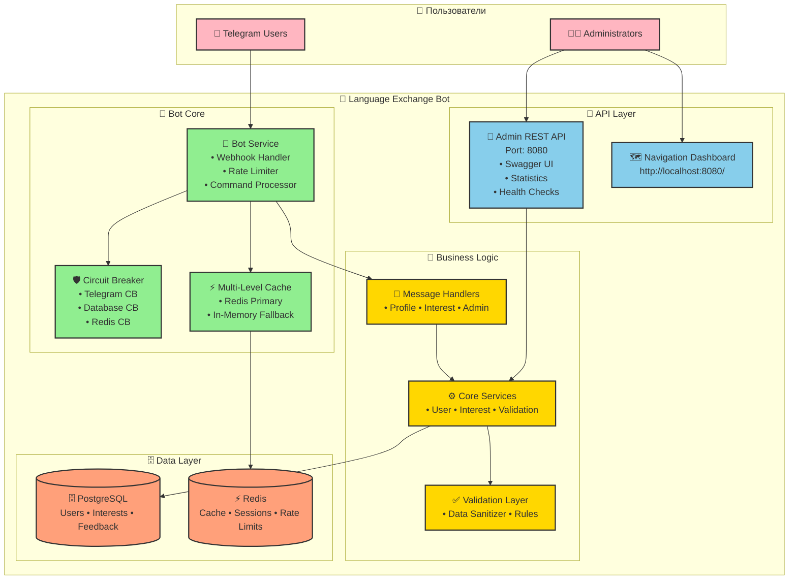
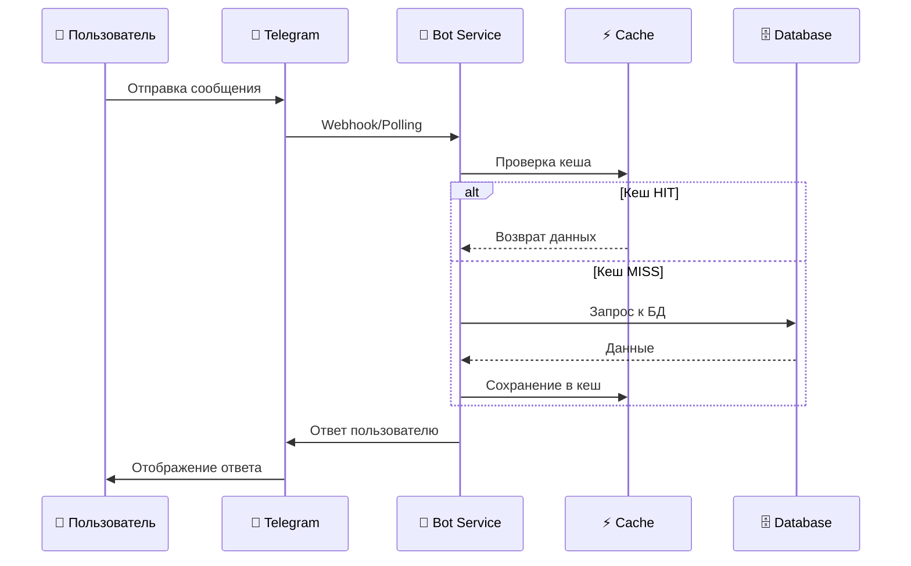
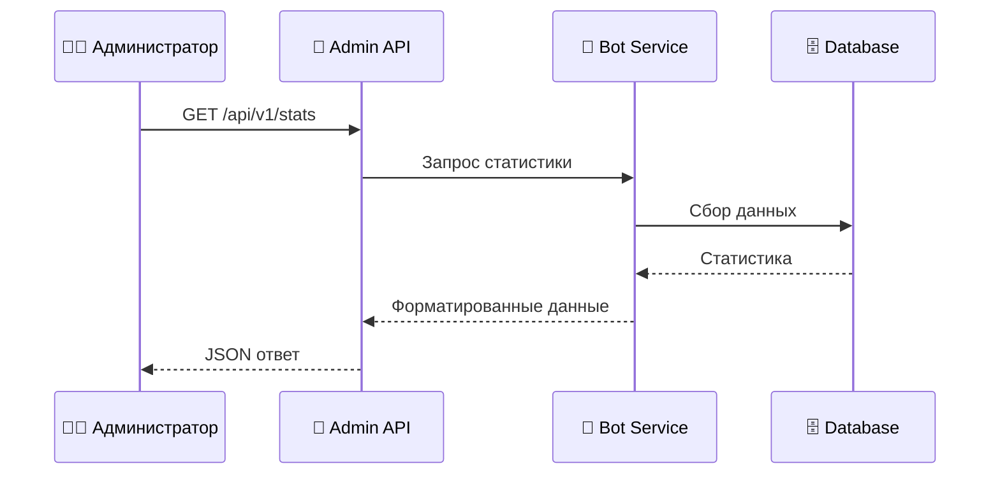

# 🏗️ Архитектура Language Exchange Bot

## 🎯 Обзор системы

**Language Exchange Bot** - это enterprise-уровень микросервисная система для поиска партнеров по изучению языков через Telegram.

### 🚀 Ключевые характеристики

- **Архитектура**: Clean Architecture + микросервисы
- **Технологии**: Go, PostgreSQL, Redis, Docker
- **Масштабируемость**: Circuit Breaker, Rate Limiting, кеширование
- **Надежность**: 200+ unit тестов, централизованная обработка ошибок
- **Мониторинг**: REST API, health checks, метрики

## 🏗️ Общая архитектура системы



## 🔧 Компоненты системы

### 🤖 **Bot Service** - Основной микросервис

| Компонент | Описание | Статус |
|-----------|----------|---------|
| **Telegram Handler** | Обработка webhook/callback от Telegram | ✅ Активен |
| **Rate Limiter** | Защита от спама (20 msg/min) | ✅ Активен |
| **Circuit Breaker** | Защита от каскадных сбоев | ✅ Активен |
| **Message Handlers** | Обработка команд и сообщений | ✅ Активен |
| **Admin API** | REST API для администрирования | ✅ Активен |
| **Health Checks** | Мониторинг состояния системы | ✅ Активен |

### 🗄️ **База данных**

| Компонент | Технология | Назначение |
|-----------|------------|------------|
| **PostgreSQL** | Реляционная БД | Основное хранилище данных |
| **Redis** | In-memory cache | Кеширование и сессии |
| **SQLite** | Для тестирования | Изоляция unit тестов |

### 🧪 **Тестирование**

| Тип тестов | Покрытие | Количество | Описание |
|------------|----------|------------|----------|
| **Unit Tests** | 20.6% | 200+ | Изоляция компонентов |
| **Integration** | 31.9% | 5+ | E2E сценарии |
| **Database Tests** | 28.6% | 25+ | CRUD операции |
| **API Tests** | 41.5% | 20+ | HTTP endpoints |

## 🎯 Clean Architecture

### 📦 **Слои архитектуры**

```shell
┌─────────────────────────────────────────────────┐
│                 Delivery Layer                   │
│  ┌─────────────────────────────────────────────┐ │
│  │           Adapters Layer                     │ │
│  │  ┌─────────────────────────────────────────┐ │ │
│  │  │        Core Business Logic               │ │ │
│  │  │  ┌─────────────────────────────────────┐ │ │ │
│  │  │  │      Database/External APIs          │ │ │ │
│  │  │  └─────────────────────────────────────┘ │ │ │
│  │  └─────────────────────────────────────────┘ │ │
│  └─────────────────────────────────────────────┘ │
└─────────────────────────────────────────────────┘
```

### 🎨 **Принципы реализации**

- **Dependency Inversion**: Высокий уровень не зависит от низкого
- **Single Responsibility**: Каждый компонент отвечает за одну функцию
- **Interface Segregation**: Клиенты не зависят от неиспользуемых интерфейсов
- **Open/Closed**: Открыты для расширения, закрыты для изменений

## 🚀 **Масштабируемость**

### ⚡ **Производительность**

- **Многоуровневое кеширование**: Redis + In-memory fallback
- **Batch loading**: 75% снижение запросов к БД
- **Connection pooling**: Оптимизация подключений к PostgreSQL
- **Rate limiting**: Защита от перегрузок

### 🛡️ **Надежность**

- **Circuit Breaker**: Автоматическое восстановление после сбоев
- **Graceful shutdown**: Безопасное завершение работы
- **Health checks**: Мониторинг состояния компонентов
- **Error handling**: Централизованная обработка ошибок

## 🔄 **Потоки данных**

### 📨 **Пользовательский поток**



### 👨‍💼 **Административный поток**



## 📊 **Мониторинг и метрики**

### 🌐 **Admin Dashboard**

- **URL**: `http://localhost:8080/`
- **Swagger UI**: `http://localhost:8080/swagger/`
- **Health checks**: `/healthz`, `/readyz`

### 📈 **Доступные метрики**

| Метрика | Endpoint | Описание |
|---------|----------|----------|
| **System Stats** | `/api/v1/stats` | Общая статистика системы |
| **Cache Stats** | `/api/v1/cache/stats` | Метрики кеширования |
| **Rate Limits** | `/api/v1/rate-limits/stats` | Статистика ограничений |
| **Circuit Breaker** | Внутренние метрики | Состояния защитных механизмов |

### 🚀 **Планируемые улучшения Navigation Dashboard**

#### **Interactive API Explorer**

- **API Testing**: Выполнение REST запросов прямо из браузера
- **Request Builder**: Визуальный конструктор запросов с параметрами
- **Response Viewer**: Форматированный просмотр ответов JSON/XML
- **History**: Сохранение истории выполненных запросов

#### **Real-time Monitoring**

- **Live Metrics**: Графики производительности с auto-refresh
- **System Health**: Реальное время статус всех компонентов
- **Performance Charts**: CPU, память, network utilization
- **Alert Dashboard**: Активные алерты с возможностью разрешения

#### **System Management**

- **Quick Actions**: Очистка кеша, перезапуск сервисов, управление конфигурацией
- **Command Execution**: Выполнение административных команд через веб-интерфейс
- **Log Management**: Просмотр и фильтрация логов в реальном времени
- **Backup/Restore**: Управление резервным копированием данных

## 🚀 **Развертывание**

### 🐳 **Docker Compose**

```yaml
services:
  bot:           # 🤖 Bot Service + Admin API
    ports: ["8080:8080"]
  postgres:      # 🗄️ PostgreSQL
    ports: ["5432:5432"]
  redis:         # ⚡ Redis Cache
    ports: ["6379:6379"]
  pgadmin:       # 🌐 Database Admin
    ports: ["8081:80"]
```

### 🔧 **Конфигурация**

| Переменная | Обязательность | Описание |
|------------|----------------|----------|
| `TELEGRAM_TOKEN` | ✅ | Токен бота от @BotFather |
| `ADMIN_API_KEY` | ✅ | Ключ для REST API |
| `DATABASE_URL` | ✅ | PostgreSQL connection string |
| `REDIS_URL` | ✅ | Redis server URL |

## 📅 **Прогноз реализации проекта**

### 📊 **Общий прогноз по фазам**

| Фаза | Название | Сроки | Статус | Приоритет | Ресурсы | Зависимости | Риски |
|------|----------|--------|---------|-----------|----------|-------------|--------|
| **Phase 1** | Enterprise-grade монолит | ✅ Завершена (2025-09) | ✅ Готово | Критический | 160 ч/чел | - | Низкий |
| **Phase 2** | Navigation Dashboard 2.0 | 🔄 В работе (2025-01 - 2025-03) | 🔄 Активна | Высокий | 240 ч/чел | Phase 1 | Средний |
| **Phase 3** | Микросервисы (Matcher + Profile) | 📋 Планируется (2025-04 - 2025-06) | 📋 Ожидает | Высокий | 320 ч/чел | Phase 1, Phase 2 | Высокий |
| **Phase 4** | Kubernetes оркестрация | 📋 Планируется (2025-07 - 2025-09) | 📋 Ожидает | Средний | 200 ч/чел | Phase 3 | Средний |
| **Phase 5** | Multi-region развертывание | 📋 Планируется (2025-10 - 2025-12) | 📋 Ожидает | Средний | 160 ч/чел | Phase 4 | Высокий |

### 🎯 **Детальная разбивка Phase 2: Navigation Dashboard 2.0**

| Этап | Компонент | Сроки | Статус | Ресурсы | Критерии готовности |
|------|------------|--------|---------|----------|---------------------|
| **2.1** | API Explorer | 2 недели (2025-01) | 📋 Планируется | 40 ч/чел | • Визуальный конструктор запросов; • Форматированный просмотр ответов; • История запросов; • Автоматическая аутентификация |
| **2.2** | Real-time Metrics | 1 неделя (2025-02) | 📋 Планируется | 20 ч/чел | • Live графики производительности; • Auto-refresh каждые 5 сек; • System health indicators; • Historical data за 24 часа |
| **2.3** | System Management | 2 недели (2025-02) | 📋 Планируется | 40 ч/чел | • Quick actions (кеш, сервисы); • Configuration editor; • Backup/Restore; • Command execution |
| **2.4** | Live Log Viewer | 1 неделя (2025-02) | 📋 Планируется | 20 ч/чел | • Real-time log streaming; • Filtering и search; • Log levels с цветовой индикацией; • Export functionality |
| **2.5** | Alert Management | 1 неделя (2025-03) | 📋 Планируется | 20 ч/чел | • Alert center с разрешением; • Real-time notifications; • Alert history и статистика; • Notification channels |
| **2.6** | UI/UX Polish | 1 неделя (2025-03) | 📋 Планируется | 20 ч/чел | • Responsive design; • Performance optimization; • Accessibility (WCAG 2.1); • Cross-browser compatibility |

### 📈 **Метрики успеха и KPIs**

| Метрика | Текущий статус | Цель Phase 2 | Цель Phase 3 | Измерение |
|---------|----------------|--------------|--------------|-----------|
| **Test Coverage** | 20.6% | 35% | 50% | Автоматизированные тесты |
| **Performance** | Baseline | +50% faster | +100% faster | Response times, throughput |
| **Availability** | 99.5% | 99.9% | 99.95% | Uptime monitoring |
| **User Satisfaction** | - | 4.5/5 | 4.8/5 | Admin feedback survey |
| **Time to Deploy** | 15 min | 5 min | 2 min | CI/CD pipeline metrics |
| **MTTR** | 30 min | 10 min | 5 min | Mean Time To Recovery |

### 🎯 **Технические риски и mitigation**

| Риск | Вероятность | Влияние | Mitigation Strategy | Ответственный |
|------|-------------|---------|-------------------|---------------|
| **WebSocket scalability** | Средняя | Высокое | • Load testing до 1000+ connections; • Connection pooling; • Horizontal scaling | Dev Team |
| **Browser compatibility** | Низкая | Среднее | • Testing на Chrome, Firefox, Safari, Edge; • Progressive enhancement; • Fallback для старых браузеров | Frontend Team |
| **Security vulnerabilities** | Средняя | Высокое | • Security code review; • Automated security scanning; • Penetration testing | Security Team |
| **Database performance** | Высокая | Высокое | • Query optimization; • Connection pooling; • Caching strategies | DBA Team |
| **API breaking changes** | Средняя | Высокое | • API versioning; • Backward compatibility; • Migration guides | API Team |

### 💰 **Ресурсный план**

#### **Команда разработки**

- **Backend Developer**: 1 FTE (Full-time equivalent)
- **Frontend Developer**: 0.5 FTE (для Phase 2)
- **DevOps Engineer**: 0.3 FTE
- **QA Engineer**: 0.5 FTE
- **Technical Lead**: 0.2 FTE (oversight)

#### **Инфраструктура и инструменты**

- **Development Environment**: Docker, VS Code, GitHub
- **Testing**: Jest (frontend), Go testing (backend), Selenium (E2E)
- **CI/CD**: GitHub Actions, Docker Hub
- **Monitoring**: Prometheus, Grafana, ELK stack
- **Documentation**: Markdown, Mermaid diagrams

#### **Бюджет (примерный)**

- **Phase 2 (Navigation Dashboard)**: $15,000 - $20,000
- **Phase 3 (Microservices)**: $25,000 - $35,000
- **Phase 4 (Kubernetes)**: $12,000 - $18,000
- **Phase 5 (Multi-region)**: $20,000 - $30,000

### 📋 **Критерии перехода между фазами**

#### **Phase 1 → Phase 2**

- ✅ Все unit тесты написаны (200+ тестов)
- ✅ Enterprise-grade архитектура реализована
- ✅ Production-ready deployment настроен
- ✅ Документация обновлена

#### **Phase 2 → Phase 3**

- ✅ Navigation Dashboard 2.0 полностью функционален
- ✅ API Explorer протестирован с реальными endpoints
- ✅ Real-time monitoring показывает корректные метрики
- ✅ System management operations работают стабильно
- ✅ Performance benchmarks соответствуют требованиям

#### **Phase 3 → Phase 4**

- ✅ Matcher и Profile сервисы развернуты
- ✅ Service-to-service коммуникация работает
- ✅ API Gateway routing настроен
- ✅ End-to-end testing всех сервисов прошло

### 🎯 **Success Metrics по завершении проекта**

| Категория | Метрика | Целевое значение | Измерение |
|-----------|---------|------------------|-----------|
| **Performance** | Response Time | <100ms для API | Load testing |
| **Scalability** | Concurrent Users | 10,000+ | Load testing |
| **Reliability** | Uptime | 99.95% | Monitoring |
| **Security** | Vulnerabilities | 0 critical/high | Security scans |
| **Maintainability** | Code Coverage | 50%+ | Unit tests |
| **User Experience** | Admin Satisfaction | 4.8/5 | Surveys |
| **Business Value** | Time Savings | 70% reduction | Time tracking |

## 🔮 **Планы развития**

### 📋 **Roadmap**

1. **Phase 1** ✅ *Завершена*: Enterprise-grade монолит
2. **Phase 2** 🔄 *В работе*: Navigation Dashboard 2.0 (8 недель)
3. **Phase 3** 📋 *Планируется*: Микросервисы (Matcher + Profile)
4. **Phase 4** 📋 *Планируется*: Kubernetes оркестрация
5. **Phase 5** 📋 *Планируется*: Multi-region развертывание

### 🎯 **Будущие улучшения**

- **Matcher Service**: Алгоритмы подбора партнеров
- **Profile Service**: Управление профилями пользователей
- **API Gateway**: Единая точка входа
- **CI/CD Pipeline**: Полная автоматизация
