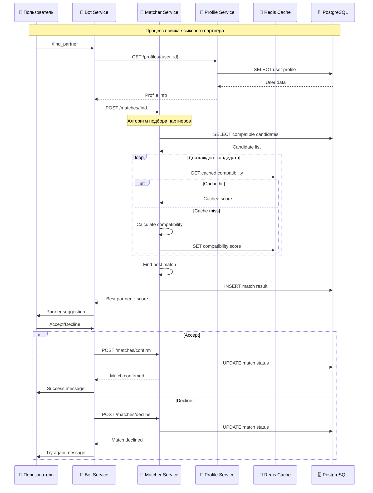
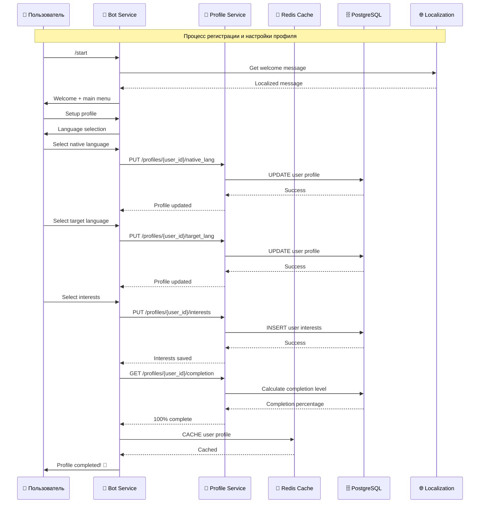
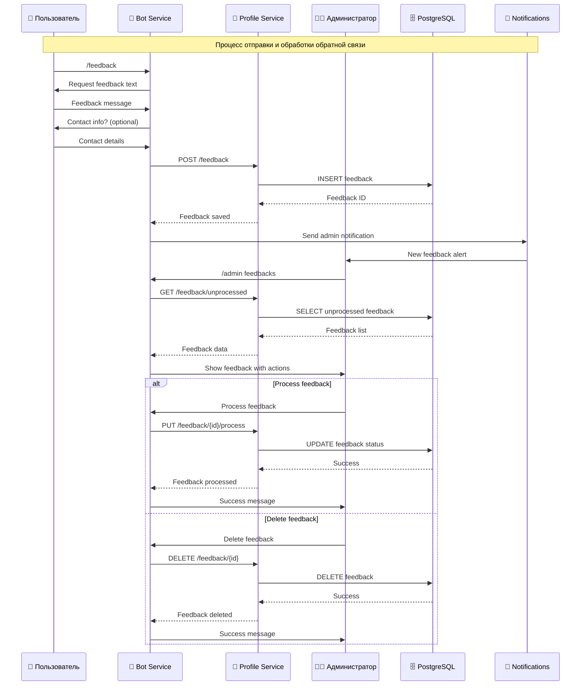

# Архитектура и логика работы алгоритма подбора языковых партнеров

## Общая концепция системы

**Цель**: Найти одного идеального языкового друга для каждого пользователя на основе взаимной совместимости языков, интересов, стиля общения и временной доступности.

**Принцип**: Качество важнее количества — система ищет **одного оптимального партнера**, а не множество вариантов.

## 1. Архитектура базы данных

### Основные таблицы

#### `users` — базовая информация о пользователях

```sql

CREATE TABLE users (
    id SERIAL PRIMARY KEY,
    telegram_id BIGINT UNIQUE NOT NULL,
    username TEXT,
    first_name TEXT,
    created_at TIMESTAMP DEFAULT NOW(),
    state TEXT DEFAULT '',  -- Для состояний диалога
    profile_completion_level INT DEFAULT 1,
    status TEXT DEFAULT 'not_started' CHECK (status IN ('not_started', 'filling', 'ready', 'matched', 'waiting'))  -- Новое: статусы для подбора и распределения
);

```

#### `languages` — справочник языков

```sql

CREATE TABLE languages (
id SERIAL PRIMARY KEY,
code VARCHAR(10),
name TEXT
);

```

#### `user_language_pairs` — языковые профили пользователей

```sql

CREATE TABLE user_language_pairs (
id SERIAL PRIMARY KEY,
user_id INT REFERENCES users(id),
native_language_id INT REFERENCES languages(id),
target_language_id INT REFERENCES languages(id),
target_language_level VARCHAR(10) CHECK (target_language_level IN ('A1', 'A2', 'B1', 'B2', 'C1', 'C2')),
created_at TIMESTAMP DEFAULT NOW()
);

```

#### `interests` — справочник интересов

```sql

CREATE TABLE interests (
id SERIAL PRIMARY KEY,
name_key VARCHAR(100) UNIQUE NOT NULL,  -- Ключ для локализации
category VARCHAR(50)  -- Категория интереса
);

```

#### `user_interests` — интересы пользователей

```sql

CREATE TABLE user_interests (
id SERIAL PRIMARY KEY,
user_id INT REFERENCES users(id),
interest_id INT REFERENCES interests(id),
is_primary BOOLEAN DEFAULT false,  -- Основной интерес
created_at TIMESTAMP DEFAULT NOW()
);

```

#### `user_traits` — личностные характеристики

```sql

CREATE TABLE user_traits (
id SERIAL PRIMARY KEY,
user_id INT REFERENCES users(id),
trait_type VARCHAR(50),  -- 'communication_style', 'learning_style', 'personality'
trait_value VARCHAR(100),  -- Значение характеристики
created_at TIMESTAMP DEFAULT NOW()
);

```

#### `user_time_availability` — временная доступность

```sql

CREATE TABLE user_time_availability (
id SERIAL PRIMARY KEY,
user_id INT REFERENCES users(id),
day_of_week INT CHECK (day_of_week BETWEEN 0 AND 6),  -- 0=воскресенье, 6=суббота
start_time TIME,
end_time TIME,
timezone VARCHAR(50),
created_at TIMESTAMP DEFAULT NOW()
);

```

#### `match_queue` — очередь подбора партнеров

```sql

CREATE TABLE match_queue (
id SERIAL PRIMARY KEY,
user_id INT REFERENCES users(id),
priority_score DECIMAL(5,2) DEFAULT 0.0,  -- Приоритет в очереди
status VARCHAR(20) DEFAULT 'waiting' CHECK (status IN ('waiting', 'processing', 'matched', 'failed')),
created_at TIMESTAMP DEFAULT NOW(),
updated_at TIMESTAMP DEFAULT NOW()
);

```

#### `matches` — результаты подбора

```sql

CREATE TABLE matches (
id SERIAL PRIMARY KEY,
user1_id INT REFERENCES users(id),
user2_id INT REFERENCES users(id),
compatibility_score DECIMAL(5,2),  -- Оценка совместимости (0-100)
match_reason TEXT,  -- Причина совместимости
status VARCHAR(20) DEFAULT 'active' CHECK (status IN ('active', 'completed', 'cancelled')),
created_at TIMESTAMP DEFAULT NOW(),
updated_at TIMESTAMP DEFAULT NOW(),
UNIQUE(user1_id, user2_id)
);

```

## 2. Алгоритм подбора партнеров

### 2.1 Основные принципы

1. **Взаимность языков**: Пользователь A изучает язык, который является родным для пользователя B, и наоборот
2. **Совместимость интересов**: Общие интересы увеличивают шансы на успешное общение
3. **Временная совместимость**: Пересечение доступного времени для общения
4. **Уровень языка**: Соответствие уровней владения языками
5. **Личностная совместимость**: Совместимость стилей общения и обучения

### 2.2 Алгоритм расчета совместимости

```go
type CompatibilityCalculator struct {
    languageWeight    float64  // 40% - вес языковой совместимости
    interestWeight    float64  // 25% - вес совместимости интересов
    timeWeight        float64  // 20% - вес временной совместимости
    personalityWeight float64  // 15% - вес личностной совместимости
}

func (c *CompatibilityCalculator) CalculateCompatibility(user1, user2 *User) float64 {
    languageScore := c.calculateLanguageCompatibility(user1, user2)
    interestScore := c.calculateInterestCompatibility(user1, user2)
    timeScore := c.calculateTimeCompatibility(user1, user2)
    personalityScore := c.calculatePersonalityCompatibility(user1, user2)
    
    totalScore := (languageScore * c.languageWeight) +
                  (interestScore * c.interestWeight) +
                  (timeScore * c.timeWeight) +
                  (personalityScore * c.personalityWeight)
    
    return totalScore
}
```

### 2.3 Детализация расчета совместимости

#### Языковая совместимость (40%)

```go
func (c *CompatibilityCalculator) calculateLanguageCompatibility(user1, user2 *User) float64 {
    // Проверяем взаимность языков
    if !c.isLanguageReciprocal(user1, user2) {
        return 0.0  // Нет взаимности - нет совместимости
    }
    
    // Базовый балл за взаимность
    baseScore := 70.0
    
    // Бонус за соответствие уровней
    levelBonus := c.calculateLevelCompatibility(user1, user2)
    
    // Бонус за дополнительные языки
    additionalLanguageBonus := c.calculateAdditionalLanguageBonus(user1, user2)
    
    return math.Min(100.0, baseScore + levelBonus + additionalLanguageBonus)
}

func (c *CompatibilityCalculator) isLanguageReciprocal(user1, user2 *User) bool {
    return user1.NativeLanguage == user2.TargetLanguage &&
           user2.NativeLanguage == user1.TargetLanguage
}
```

#### Совместимость интересов (25%)

```go
func (c *CompatibilityCalculator) calculateInterestCompatibility(user1, user2 *User) float64 {
    if len(user1.Interests) == 0 || len(user2.Interests) == 0 {
        return 50.0  // Нейтральный балл если нет интересов
    }
    
    commonInterests := c.findCommonInterests(user1.Interests, user2.Interests)
    totalInterests := len(user1.Interests) + len(user2.Interests)
    
    // Формула Жаккара для расчета пересечения
    jaccardIndex := float64(len(commonInterests)) / float64(totalInterests - len(commonInterests))
    
    // Бонус за основные интересы
    primaryInterestBonus := c.calculatePrimaryInterestBonus(commonInterests)
    
    return math.Min(100.0, (jaccardIndex * 100) + primaryInterestBonus)
}
```

#### Временная совместимость (20%)

```go
func (c *CompatibilityCalculator) calculateTimeCompatibility(user1, user2 *User) float64 {
    if len(user1.TimeAvailability) == 0 || len(user2.TimeAvailability) == 0 {
        return 50.0  // Нейтральный балл если нет данных о времени
    }
    
    overlappingHours := c.calculateOverlappingHours(user1.TimeAvailability, user2.TimeAvailability)
    totalPossibleHours := 24 * 7  // 168 часов в неделю
    
    overlapPercentage := float64(overlappingHours) / float64(totalPossibleHours)
    
    // Минимальный порог для общения - 2 часа в неделю
    if overlappingHours < 2 {
        return 0.0
    }
    
    return math.Min(100.0, overlapPercentage * 200)  // Масштабируем до 100
}
```

#### Личностная совместимость (15%)

```go
func (c *CompatibilityCalculator) calculatePersonalityCompatibility(user1, user2 *User) float64 {
    if len(user1.Traits) == 0 || len(user2.Traits) == 0 {
        return 50.0  // Нейтральный балл
    }
    
    communicationCompatibility := c.calculateCommunicationCompatibility(user1, user2)
    learningStyleCompatibility := c.calculateLearningStyleCompatibility(user1, user2)
    
    return (communicationCompatibility + learningStyleCompatibility) / 2
}
```

## 3. Процесс подбора партнеров

### 3.1 Sequence диаграмма процесса подбора



### 3.2 Sequence диаграмма регистрации пользователя



### 3.3 Sequence диаграмма системы обратной связи



### 3.4 Очередь подбора

```go
type MatchQueue struct {
    db *sql.DB
}

func (mq *MatchQueue) AddUserToQueue(userID int, priorityScore float64) error {
    query := `
        INSERT INTO match_queue (user_id, priority_score, status)
        VALUES ($1, $2, 'waiting')
        ON CONFLICT (user_id) DO UPDATE SET
            priority_score = $2,
            status = 'waiting',
            updated_at = NOW()
    `
    
    _, err := mq.db.Exec(query, userID, priorityScore)
    return err
}

func (mq *MatchQueue) GetNextUserForMatching() (*User, error) {
    query := `
        SELECT u.* FROM users u
        JOIN match_queue mq ON u.id = mq.user_id
        WHERE mq.status = 'waiting'
        ORDER BY mq.priority_score DESC, mq.created_at ASC
        LIMIT 1
    `
    
    // Выполняем запрос и возвращаем пользователя
    // ...
}
```

### 3.2 Алгоритм поиска партнера

```go
func (ms *MatchingService) FindPartner(userID int) (*User, float64, error) {
    user, err := ms.getUserWithProfile(userID)
    if err != nil {
        return nil, 0, err
    }
    
    // Получаем кандидатов
    candidates, err := ms.getCompatibleCandidates(user)
    if err != nil {
        return nil, 0, err
    }
    
    if len(candidates) == 0 {
        return nil, 0, errors.New("no compatible partners found")
    }
    
    // Рассчитываем совместимость для каждого кандидата
    bestMatch := candidates[0]
    bestScore := 0.0
    
    for _, candidate := range candidates {
        score := ms.compatibilityCalculator.CalculateCompatibility(user, candidate)
        if score > bestScore {
            bestScore = score
            bestMatch = candidate
        }
    }
    
    // Минимальный порог совместимости
    if bestScore < 60.0 {
        return nil, 0, errors.New("no sufficiently compatible partners found")
    }
    
    return bestMatch, bestScore, nil
}
```

### 3.3 Получение кандидатов

```go
func (ms *MatchingService) getCompatibleCandidates(user *User) ([]*User, error) {
    query := `
        SELECT DISTINCT u.* FROM users u
        JOIN user_language_pairs ulp1 ON u.id = ulp1.user_id
        JOIN user_language_pairs ulp2 ON ulp1.target_language_id = ulp2.native_language_id
        WHERE ulp2.user_id = $1
        AND ulp1.native_language_id = ulp2.target_language_id
        AND u.id != $1
        AND u.status = 'ready'
        AND NOT EXISTS (
            SELECT 1 FROM matches m 
            WHERE (m.user1_id = $1 AND m.user2_id = u.id) 
            OR (m.user1_id = u.id AND m.user2_id = $1)
        )
    `
    
    rows, err := ms.db.Query(query, user.ID)
    if err != nil {
        return nil, err
    }
    defer rows.Close()
    
    var candidates []*User
    for rows.Next() {
        candidate := &User{}
        // Сканируем данные пользователя
        // ...
        candidates = append(candidates, candidate)
    }
    
    return candidates, nil
}
```

## 4. Оптимизации и производительность

### 4.1 Индексы базы данных

```sql
-- Индексы для быстрого поиска
CREATE INDEX idx_users_status ON users(status);
CREATE INDEX idx_user_language_pairs_native ON user_language_pairs(native_language_id);
CREATE INDEX idx_user_language_pairs_target ON user_language_pairs(target_language_id);
CREATE INDEX idx_user_interests_user_id ON user_interests(user_id);
CREATE INDEX idx_user_time_availability_user_id ON user_time_availability(user_id);
CREATE INDEX idx_match_queue_status_priority ON match_queue(status, priority_score DESC);

-- Составные индексы для сложных запросов
CREATE INDEX idx_language_reciprocity ON user_language_pairs(native_language_id, target_language_id);
CREATE INDEX idx_user_availability ON user_time_availability(user_id, day_of_week);
```

### 4.2 Кэширование

```go
type MatchingCache struct {
    redis *redis.Client
}

func (mc *MatchingCache) CacheCompatibilityScore(user1ID, user2ID int, score float64) error {
    key := fmt.Sprintf("compatibility:%d:%d", user1ID, user2ID)
    return mc.redis.Set(key, score, 24*time.Hour).Err()
}

func (mc *MatchingCache) GetCachedCompatibilityScore(user1ID, user2ID int) (float64, error) {
    key := fmt.Sprintf("compatibility:%d:%d", user1ID, user2ID)
    result := mc.redis.Get(key)
    if result.Err() != nil {
        return 0, result.Err()
    }
    
    return result.Float64()
}
```

### 4.3 Асинхронная обработка

```go
type MatchingWorker struct {
    queue    chan int
    matcher  *MatchingService
    results  chan MatchResult
}

func (mw *MatchingWorker) Start() {
    go func() {
        for userID := range mw.queue {
            partner, score, err := mw.matcher.FindPartner(userID)
            result := MatchResult{
                UserID: userID,
                Partner: partner,
                Score: score,
                Error: err,
            }
            mw.results <- result
        }
    }()
}
```

## 5. Мониторинг и метрики

### 5.1 Ключевые метрики

```go
type MatchingMetrics struct {
    TotalMatches        prometheus.Counter
    SuccessfulMatches   prometheus.Counter
    FailedMatches       prometheus.Counter
    AverageCompatibility prometheus.Histogram
    MatchingDuration    prometheus.Histogram
    QueueSize           prometheus.Gauge
}

func (mm *MatchingMetrics) RecordMatch(userID, partnerID int, score float64, duration time.Duration) {
    mm.TotalMatches.Inc()
    mm.SuccessfulMatches.Inc()
    mm.AverageCompatibility.Observe(score)
    mm.MatchingDuration.Observe(duration.Seconds())
}
```

### 5.2 Алерты

- **Высокий размер очереди**: > 100 пользователей в очереди
- **Низкий процент успешных матчей**: < 30% успешных подборов
- **Высокое время обработки**: > 5 секунд на подбор
- **Ошибки в алгоритме**: > 5% ошибок при подборе

## 6. Будущие улучшения

### 6.1 Machine Learning

- **Предсказание успешности матча**: ML модель для предсказания долгосрочного успеха
- **Персонализация весов**: Адаптивные веса совместимости на основе обратной связи
- **Кластеризация пользователей**: Группировка похожих пользователей для быстрого поиска

### 6.2 Расширенные алгоритмы

- **Временные паттерны**: Анализ активности пользователей для лучшего подбора времени
- **Социальные связи**: Учет общих знакомых и социальных сетей
- **Географическая близость**: Учет часовых поясов и культурной близости

### 6.3 A/B тестирование

- **Разные веса совместимости**: Тестирование различных комбинаций весов
- **Альтернативные алгоритмы**: Сравнение различных подходов к подбору
- **Пользовательский опыт**: Тестирование различных интерфейсов для матчинга
