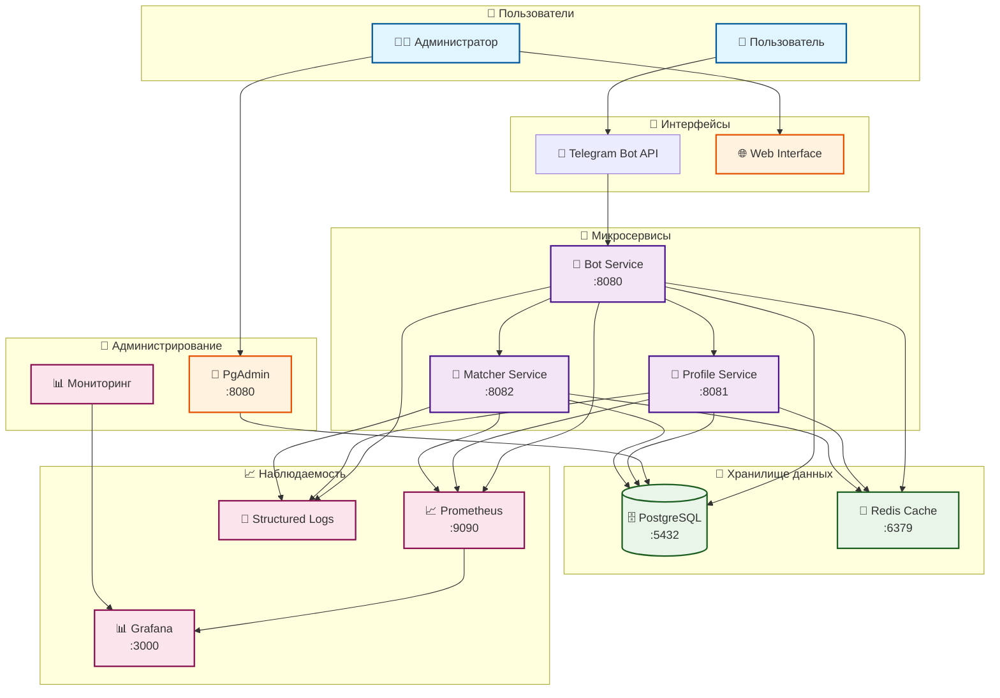
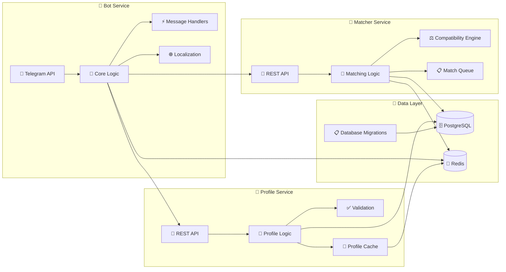
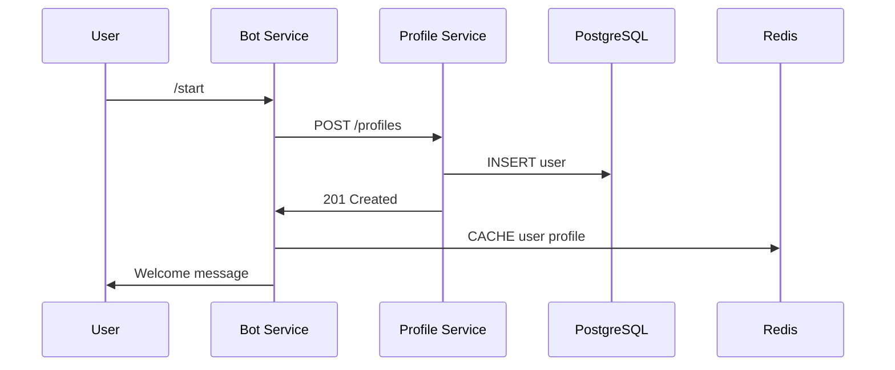
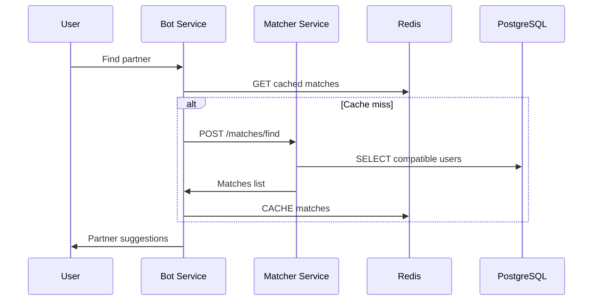

# 🏗️ Архитектура Language Exchange Bot

## 📋 Обзор системы

Language Exchange Bot построен на микросервисной архитектуре с четким разделением ответственности, высокой производительностью и отказоустойчивостью.

## 🏛️ Общая архитектура

### Системная диаграмма



### Детальная архитектура сервисов



## 🎯 Сервисы и их роли

### 🤖 Bot Service (Основной бот)

**Порт**: 8080  
**Ответственность**:

- Обработка Telegram сообщений
- Пользовательский интерфейс
- Локализация
- Административные функции
- Обратная связь

**Технологии**:

- Go 1.21 + Telegram Bot API
- Redis для кэширования
- Zap для логирования
- Prometheus для метрик

**Endpoints**:

- `GET /health` - Health check
- `GET /metrics` - Prometheus метрики
- `POST /webhook` - Telegram webhook

### 👤 Profile Service

**Порт**: 8081  
**Ответственность**:

- CRUD операции с профилями
- Управление языковыми настройками
- Интересы и предпочтения
- Статистика пользователей

**API Endpoints**:

```http
GET /profiles/{user_id}      # Получение профиля
PUT /profiles/{user_id}      # Обновление профиля
DELETE /profiles/{user_id}   # Удаление профиля
GET /profiles/{user_id}/stats # Статистика
```

### 🎯 Matcher Service

**Порт**: 8082  
**Ответственность**:

- Алгоритмы подбора партнеров
- Совместимость по языкам
- Фильтрация по интересам
- Очередь матчинга

**API Endpoints**:

```http
POST /matches/find           # Поиск партнеров
GET /matches/{user_id}       # Текущие матчи
POST /matches/feedback       # Обратная связь по матчу
```

## 🗄️ База данных

### PostgreSQL 15

**Структура схем**:

- `public` - Основные таблицы
- `profile` - Данные профилей
- `matching` - Алгоритмы подбора
- `feedback` - Система отзывов

### Основные таблицы

```sql
-- Пользователи
users (
    id SERIAL PRIMARY KEY,
    telegram_id BIGINT UNIQUE,
    username VARCHAR(255),
    first_name VARCHAR(255),
    interface_language_code VARCHAR(10),
    native_language_code VARCHAR(10),
    target_language_code VARCHAR(10),
    target_language_level VARCHAR(10),
    status VARCHAR(50),
    profile_completion_level INTEGER,
    created_at TIMESTAMP,
    updated_at TIMESTAMP
);

-- Языки
languages (
    id SERIAL PRIMARY KEY,
    code VARCHAR(10) UNIQUE,
    name VARCHAR(100),
    english_name VARCHAR(100)
);

-- Интересы
interests (
    id SERIAL PRIMARY KEY,
    name_key VARCHAR(100),
    category VARCHAR(50)
);

-- Интересы пользователей
user_interests (
    user_id INTEGER REFERENCES users(id),
    interest_id INTEGER REFERENCES interests(id),
    is_primary BOOLEAN DEFAULT false,
    PRIMARY KEY (user_id, interest_id)
);

-- Обратная связь
feedback (
    id SERIAL PRIMARY KEY,
    user_id INTEGER REFERENCES users(id),
    feedback_text TEXT,
    contact_info TEXT,
    is_processed BOOLEAN DEFAULT false,
    admin_response TEXT,
    created_at TIMESTAMP,
    updated_at TIMESTAMP
);
```

## 🔴 Redis Cache

### Структура кэширования

```redis
# Языки (TTL: 24 часа)
languages: [{"id":1,"code":"en","name":"English"}...]

# Интересы по языкам (TTL: 12 часов)
interests:ru: {"1":"Фильмы","2":"Музыка"}
interests:en: {"1":"Movies","2":"Music"}

# Профили пользователей (TTL: 30 минут)
user:12345: {"id":12345,"name":"Ivan","native":"ru"}

# Результаты поиска (TTL: 15 минут)
matches:12345: [{"user_id":67890,"compatibility":95}]

# Статистика (TTL: 1 час)
stats:daily: {"active_users":150,"new_profiles":23}
```

### Стратегии кэширования

- **Cache-Aside**: Профили пользователей
- **Write-Through**: Статистика
- **Write-Behind**: Метрики производительности

## 🔄 Взаимодействие сервисов

### 1. Регистрация пользователя



### 2. Поиск партнера



## 📊 Мониторинг и наблюдаемость

### Метрики Prometheus

```yaml
# Bot Service
telegram_messages_total         # Счетчик сообщений
telegram_commands_duration      # Время выполнения команд
database_queries_total          # Счетчик запросов к БД
cache_hits_total               # Попадания в кэш
cache_misses_total            # Промахи кэша

# Profile Service
profiles_created_total         # Созданные профили
profiles_updated_total        # Обновленные профили
api_requests_duration_seconds # Время отклика API

# Matcher Service
matches_found_total           # Найденные матчи
matching_algorithm_duration  # Время выполнения алгоритма
compatibility_score_histogram # Распределение совместимости
```

### Структурированное логирование

```json
{
  "timestamp": "2025-09-18T12:00:00Z",
  "level": "info",
  "service": "bot",
  "component": "telegram_handler",
  "message": "User profile updated",
  "user_id": 12345,
  "telegram_id": 123456789,
  "action": "profile_update",
  "duration_ms": 150,
  "request_id": "req_abc123",
  "metadata": {
    "language": "ru",
    "completion_level": 85
  }
}
```

## 🛡️ Безопасность

### Защита на уровне сети

- **Rate Limiting**: 100 запросов/минуту на пользователя
- **IP Whitelisting**: Ограничение доступа к админ API
- **DDoS Protection**: Circuit Breaker паттерн

### Защита данных

- **Шифрование**: TLS 1.3 для всех соединений
- **Валидация**: Строгая проверка всех входных данных
- **Санитизация**: Очистка пользовательского ввода

### Аутентификация и авторизация

```go
// Проверка администратора
func (h *AdminHandler) IsAdmin(chatID int64, username string) bool {
    // Проверка по Chat ID
    for _, adminID := range h.adminChatIDs {
        if chatID == adminID {
            return true
        }
    }
    
    // Проверка по Username
    for _, adminUsername := range h.adminUsernames {
        if username == adminUsername {
            return true
        }
    }
    
    return false
}
```

## 🚀 Масштабирование

### Горизонтальное масштабирование

- **Stateless сервисы**: Все состояние в Redis/PostgreSQL
- **Load Balancer**: Nginx для распределения нагрузки
- **Database Replication**: Master-Slave для чтения

### Вертикальное масштабирование

- **Connection Pooling**: Оптимальное использование БД
- **Batch Operations**: Массовые операции
- **Async Processing**: Неблокирующие операции

### Автомасштабирование

```yaml
# docker-compose.yml
services:
  bot:
    deploy:
      replicas: 3
      resources:
        limits:
          cpus: '0.50'
          memory: 512M
        reservations:
          cpus: '0.25'
          memory: 256M
```

## 🔄 Паттерны и принципы

### Clean Architecture

```shell
┌─────────────────────────────────────┐
│           Frameworks & Drivers      │
│  (Telegram API, PostgreSQL, Redis) │
├─────────────────────────────────────┤
│        Interface Adapters           │
│     (Controllers, Gateways)         │
├─────────────────────────────────────┤
│         Application Business        │
│         Rules (Use Cases)           │
├─────────────────────────────────────┤
│        Enterprise Business          │
│           Rules (Entities)          │
└─────────────────────────────────────┘
```

### SOLID принципы

- **S**ingle Responsibility: Один сервис = одна ответственность
- **O**pen/Closed: Расширяемость через интерфейсы
- **L**iskov Substitution: Заменяемость реализаций
- **I**nterface Segregation: Минимальные интерфейсы
- **D**ependency Inversion: Зависимость от абстракций

### Паттерны проектирования

- **Repository**: Абстракция доступа к данным
- **Factory**: Создание сервисов
- **Strategy**: Алгоритмы подбора партнеров
- **Observer**: Уведомления администраторов
- **Circuit Breaker**: Отказоустойчивость

## 📈 Производительность

### Оптимизации

- **Redis кэширование**: 50x ускорение доступа к данным
- **Connection pooling**: Эффективное использование БД
- **Batch операции**: Массовые обновления профилей
- **Lazy loading**: Загрузка данных по требованию

### Benchmarks

```shell
Операция                    | Без кэша  | С кэшем   | Ускорение
----------------------------|-----------|-----------|----------
Загрузка языков            | 50ms      | 1ms       | 50x
Получение профиля          | 25ms      | 2ms       | 12.5x
Поиск интересов           | 30ms      | 1.5ms     | 20x
Локализация               | 15ms      | 0.5ms     | 30x
```

## 🔮 Будущее развитие

### Планируемые улучшения

- **GraphQL API**: Более гибкие запросы
- **Event Sourcing**: Аудит всех изменений
- **CQRS**: Разделение команд и запросов
- **WebSocket**: Реальное время общения
- **ML Matching**: ИИ для лучшего подбора

### Новые сервисы

- **Notification Service**: Централизованные уведомления
- **Analytics Service**: Продвинутая аналитика
- **Chat Service**: Встроенный чат
- **Recommendation Service**: Рекомендации контента

---

**Документация**: [README.md](../README.md)  
**Настройка**: [SETUP_GUIDE.md](SETUP_GUIDE.md)  
**Безопасность**: [SECURITY.md](../reports/SECURITY.md)
