# 📊 Диаграммы Language Exchange Bot

## 🎯 Обзор

Этот документ содержит все Mermaid диаграммы проекта для лучшего понимания архитектуры и процессов.

## 🏗️ Архитектурные диаграммы

### Общая системная архитектура

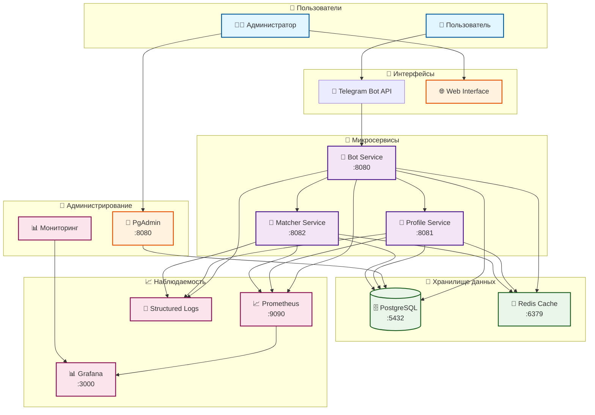

### Детальная архитектура компонентов

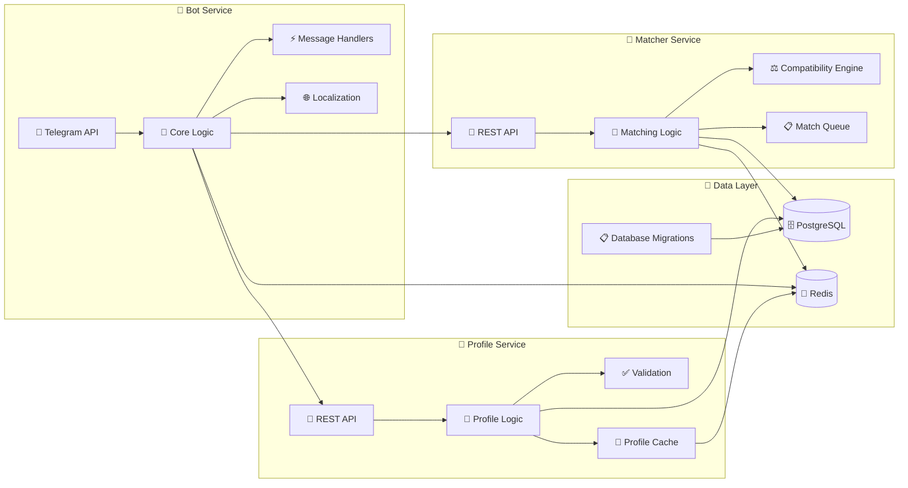

### Схема базы данных

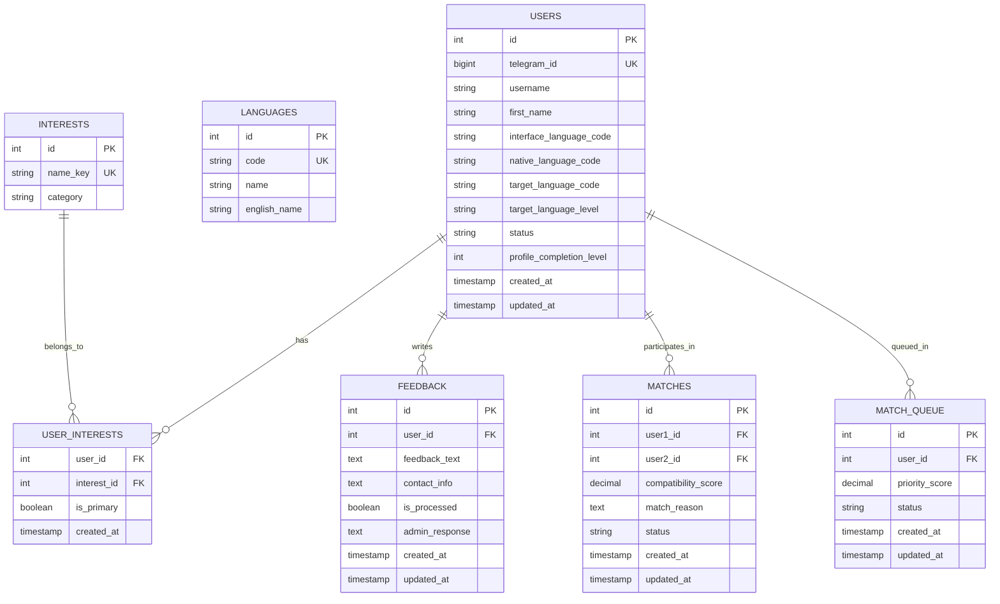

## 🔄 Sequence диаграммы процессов

### Процесс поиска языкового партнера

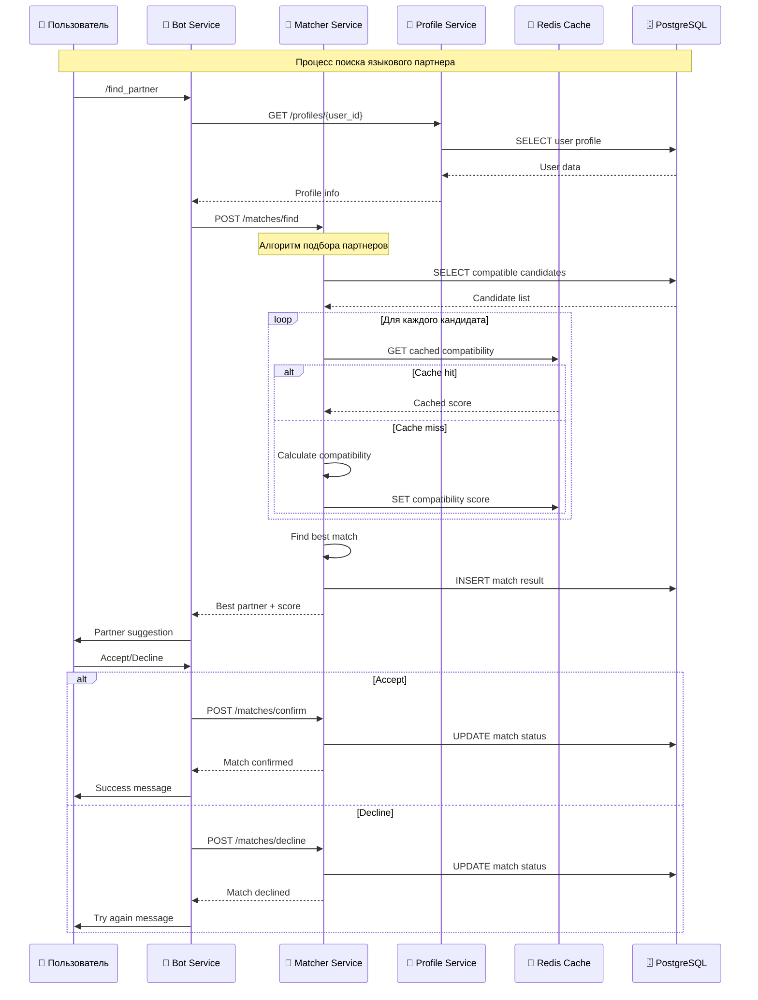

### Процесс регистрации пользователя

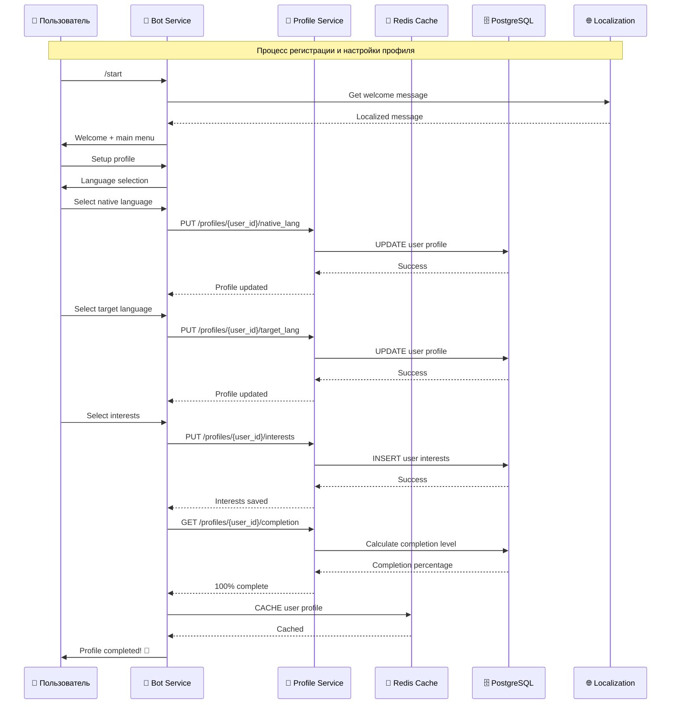

### Система обратной связи

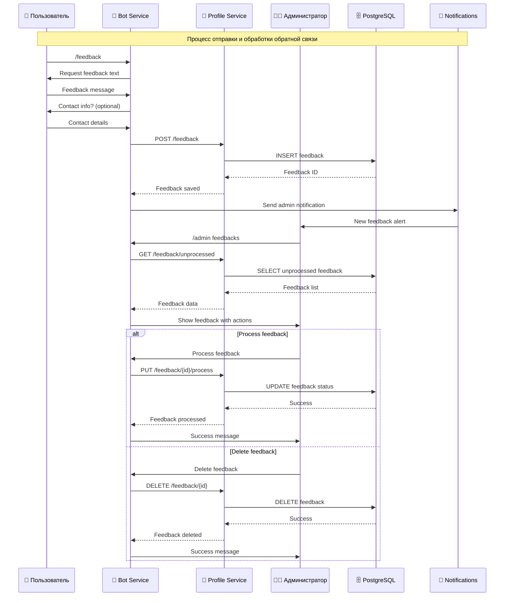

### Мониторинг и логирование

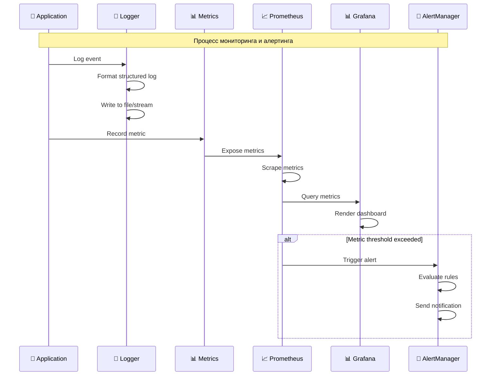

## 🎯 Диаграммы алгоритмов

### Алгоритм расчета совместимости

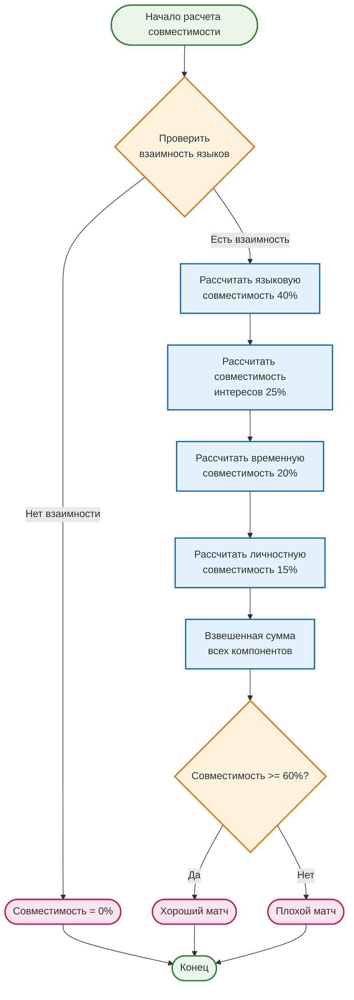

### Процесс кэширования

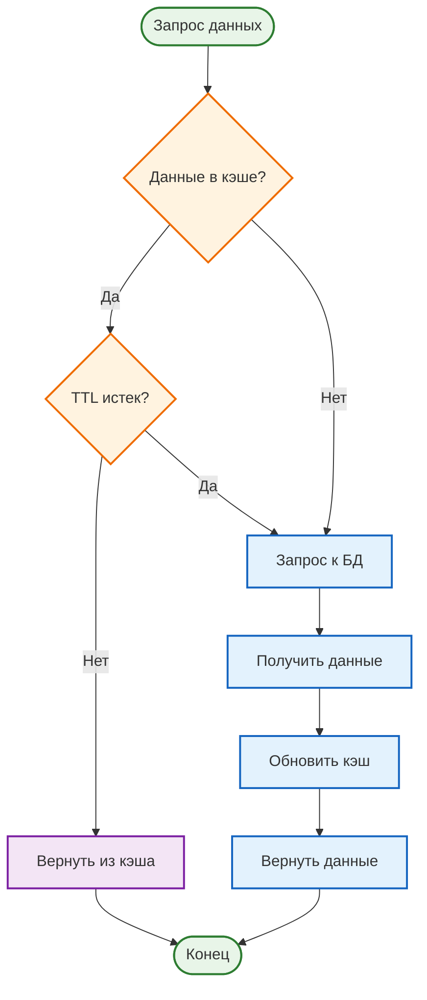

## 🚀 Диаграммы развертывания

### Docker Compose архитектура

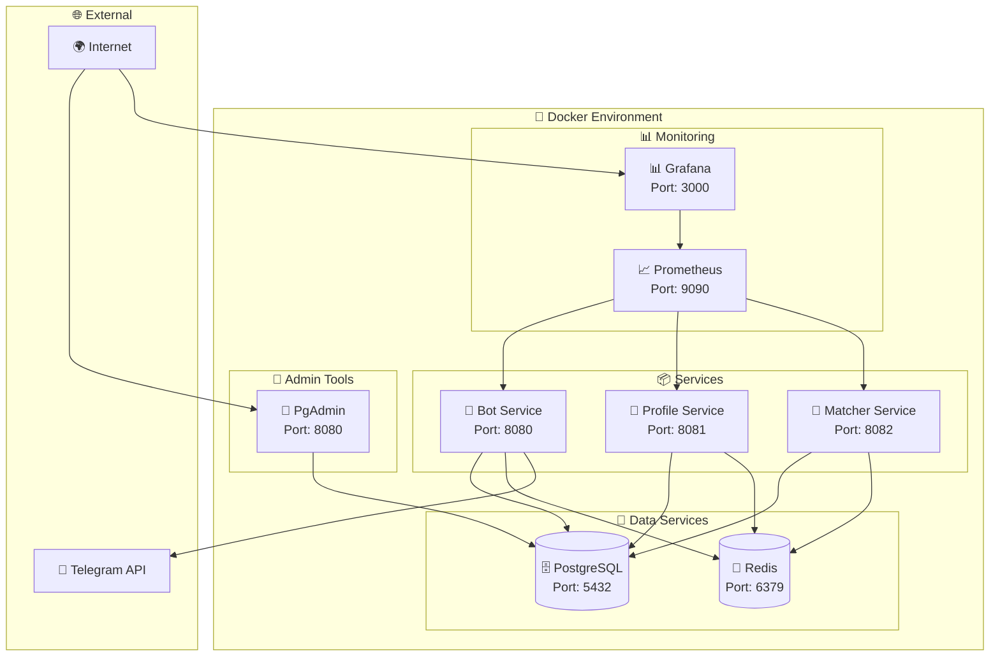

### CI/CD Pipeline

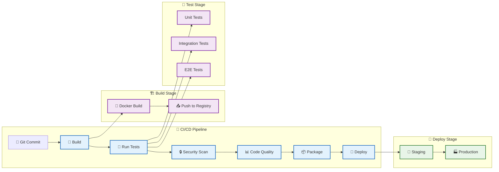

## 📈 Диаграммы производительности

### Архитектура кэширования

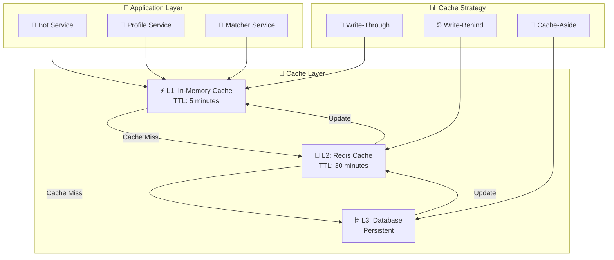

### Мониторинг производительности

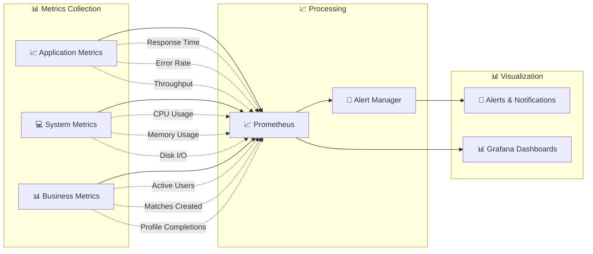

---

**Примечание**: Все диаграммы созданы с использованием Mermaid и могут быть отображены в GitHub, GitLab и других поддерживающих Mermaid платформах.
