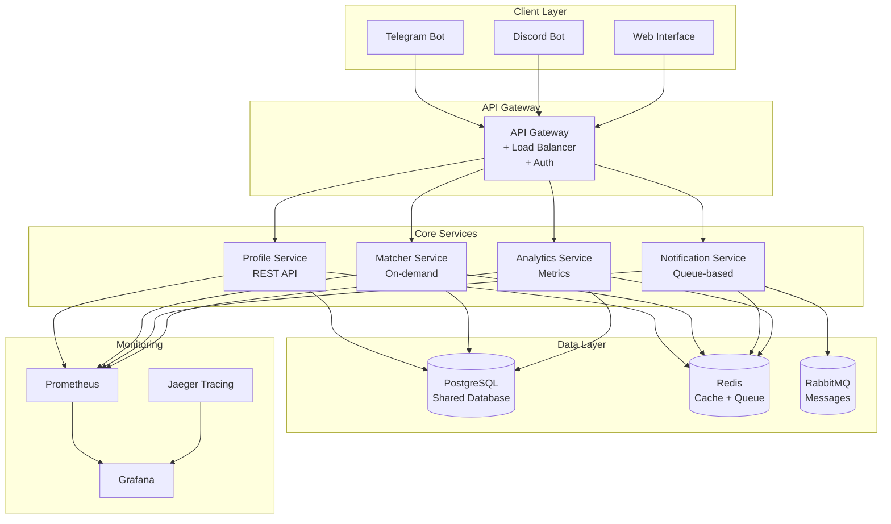

# 🚀 План миграции на микросервисную архитектуру

**Дата создания**: 2025-01-18  
**Версия**: 1.0.0  
**Статус**: 📋 В разработке

## 📋 Обзор

Данный документ описывает детальный план разделения монолитного Language Exchange Bot на микросервисную архитектуру с использованием современных практик разработки.

## 🎯 Цели миграции

### Основные цели

- **Масштабируемость** - независимое масштабирование каждого сервиса
- **Надежность** - изоляция отказов между сервисами
- **Разработка** - параллельная разработка команд
- **Технологическая гибкость** - возможность использования разных технологий
- **Производительность** - оптимизация каждого сервиса отдельно

### Технические цели

- **Response time** < 200ms для всех API
- **Availability** 99.9% для критических сервисов
- **Throughput** 1000+ запросов/минуту
- **Test coverage** 95%+ для всех сервисов

## 🏗️ Архитектура микросервисов

### Схема архитектуры



## 📦 Структура сервисов

### 1. **Profile Service** 🧑‍💼

**Назначение**: Управление профилями пользователей

**Функции**:

- CRUD операции с профилями
- Управление языками и интересами
- Валидация данных профиля
- Кэширование профилей

**API Endpoints**:

```shell
GET    /api/v1/profiles/{user_id}
POST   /api/v1/profiles
PUT    /api/v1/profiles/{user_id}
DELETE /api/v1/profiles/{user_id}
GET    /api/v1/profiles/{user_id}/completion
PUT    /api/v1/profiles/{user_id}/languages
PUT    /api/v1/profiles/{user_id}/interests
```

**Технологии**:

- Go + Gin/Echo
- PostgreSQL
- Redis (кэш)
- Swagger/OpenAPI

### 2. **Matcher Service** 🎯

**Назначение**: Алгоритм подбора партнеров (on-demand)

**Функции**:

- Алгоритм совместимости
- Очередь подбора партнеров
- Batch обработка
- Кэширование результатов

**API Endpoints**:

```shell
POST   /api/v1/matcher/match
GET    /api/v1/matcher/queue
POST   /api/v1/matcher/process
GET    /api/v1/matcher/results/{user_id}
```

**Технологии**:

- Go + Gin/Echo
- PostgreSQL
- Redis (кэш + очередь)
- RabbitMQ (задачи)

### 3. **Notification Service** 📢

**Назначение**: Уведомления и сообщения

**Функции**:

- Обработка очереди уведомлений
- Отправка в Telegram/Discord
- Retry логика
- Dead letter queue

**API Endpoints**:

```shell
POST   /api/v1/notifications/send
GET    /api/v1/notifications/status
POST   /api/v1/notifications/retry
```

**Технологии**:

- Go + Gin/Echo
- RabbitMQ
- Redis (кэш)
- Telegram/Discord API

### 4. **Analytics Service** 📊

**Назначение**: Аналитика и метрики

**Функции**:

- Сбор метрик
- Агрегация данных
- Экспорт в Prometheus
- Дашборды

**API Endpoints**:

```shell
GET    /api/v1/analytics/metrics
GET    /api/v1/analytics/users
GET    /api/v1/analytics/matches
GET    /api/v1/analytics/performance
```

**Технологии**:

- Go + Gin/Echo
- PostgreSQL
- Prometheus
- Grafana

### 5. **API Gateway** 🌐

**Назначение**: Единая точка входа

**Функции**:

- Маршрутизация запросов
- Аутентификация (JWT)
- Rate limiting
- Load balancing
- Логирование

**Технологии**:

- Go + Gin/Echo
- JWT
- Rate limiting middleware
- Prometheus metrics

### 6. **Bot Service** 🤖

**Назначение**: Telegram/Discord интерфейс

**Функции**:

- Обработка команд
- UI логика
- Интеграция с API Gateway
- Webhook handling

**Технологии**:

- Go + tgbotapi
- Discord API
- Webhook support

## 🔄 Потоки данных

### 1. **Создание профиля**

```shell
User → Bot → API Gateway → Profile Service → Database
                ↓
            Notification Service → RabbitMQ → User
```

### 2. **Подбор партнера**

```shell
Admin → Bot → API Gateway → Matcher Service → Database
                ↓
            Notification Service → RabbitMQ → Users
```

### 3. **Уведомления**

```shell
Event → Notification Service → RabbitMQ → Bot → User
```

## 🗄️ Структура базы данных

### Общие таблицы

```sql
-- Пользователи
CREATE TABLE users (
    id SERIAL PRIMARY KEY,
    telegram_id BIGINT UNIQUE,
    discord_id BIGINT UNIQUE,
    username VARCHAR(255),
    first_name VARCHAR(255),
    created_at TIMESTAMP DEFAULT NOW(),
    updated_at TIMESTAMP DEFAULT NOW()
);

-- Профили
CREATE TABLE profiles (
    id SERIAL PRIMARY KEY,
    user_id INTEGER REFERENCES users(id),
    native_language_code VARCHAR(10),
    target_language_code VARCHAR(10),
    language_level VARCHAR(20),
    bio TEXT,
    completion_percentage INTEGER DEFAULT 0,
    created_at TIMESTAMP DEFAULT NOW(),
    updated_at TIMESTAMP DEFAULT NOW()
);

-- Языки
CREATE TABLE languages (
    id SERIAL PRIMARY KEY,
    code VARCHAR(10) UNIQUE,
    name VARCHAR(100),
    native_name VARCHAR(100)
);

-- Интересы
CREATE TABLE interests (
    id SERIAL PRIMARY KEY,
    name VARCHAR(100),
    category VARCHAR(50)
);

-- Связи пользователей с интересами
CREATE TABLE user_interests (
    user_id INTEGER REFERENCES users(id),
    interest_id INTEGER REFERENCES interests(id),
    PRIMARY KEY (user_id, interest_id)
);

-- Очередь подбора партнеров
CREATE TABLE matcher_queue (
    id SERIAL PRIMARY KEY,
    user_id INTEGER REFERENCES users(id),
    priority INTEGER DEFAULT 0,
    status VARCHAR(20) DEFAULT 'pending',
    created_at TIMESTAMP DEFAULT NOW(),
    processed_at TIMESTAMP
);

-- Результаты подбора
CREATE TABLE matches (
    id SERIAL PRIMARY KEY,
    user1_id INTEGER REFERENCES users(id),
    user2_id INTEGER REFERENCES users(id),
    compatibility_score INTEGER,
    created_at TIMESTAMP DEFAULT NOW()
);

-- Логи уведомлений
CREATE TABLE notification_logs (
    id SERIAL PRIMARY KEY,
    user_id INTEGER REFERENCES users(id),
    type VARCHAR(50),
    content TEXT,
    status VARCHAR(20),
    sent_at TIMESTAMP,
    created_at TIMESTAMP DEFAULT NOW()
);
```

### Специфичные таблицы по сервисам

```sql
-- Profile Service
CREATE TABLE profile_metadata (
    user_id INTEGER PRIMARY KEY REFERENCES users(id),
    last_activity TIMESTAMP,
    profile_views INTEGER DEFAULT 0,
    settings JSONB
);

-- Matcher Service
CREATE TABLE matcher_config (
    id SERIAL PRIMARY KEY,
    algorithm_version VARCHAR(20),
    parameters JSONB,
    updated_at TIMESTAMP DEFAULT NOW()
);

-- Analytics Service
CREATE TABLE analytics_events (
    id SERIAL PRIMARY KEY,
    event_type VARCHAR(50),
    user_id INTEGER REFERENCES users(id),
    data JSONB,
    created_at TIMESTAMP DEFAULT NOW()
);
```

## 🔧 Технологический стек

### Backend

- **Go 1.22+** - основной язык
- **Gin/Echo** - HTTP фреймворки
- **PostgreSQL** - основная БД
- **Redis** - кэш и очереди
- **RabbitMQ** - сообщения

### Мониторинг

- **Prometheus** - метрики
- **Grafana** - дашборды
- **Jaeger** - трейсинг
- **ELK Stack** - логи

### DevOps

- **Docker** - контейнеризация
- **Docker Compose** - оркестрация
- **GitHub Actions** - CI/CD
- **Makefile** - автоматизация

### Безопасность

- **JWT** - аутентификация
- **Rate Limiting** - защита от DDoS
- **Input Validation** - валидация данных
- **CORS** - настройки безопасности

## 📋 План миграции

### Фаза 1: Подготовка (1-2 недели)

- [ ] Создание структуры проекта
- [ ] Настройка shared библиотек
- [ ] Настройка CI/CD pipeline
- [ ] Создание базовых Docker образов

### Фаза 2: Profile Service (2-3 недели)

- [ ] Создание Profile Service
- [ ] API endpoints
- [ ] Интеграция с БД
- [ ] Unit и integration тесты
- [ ] Swagger документация

### Фаза 3: Matcher Service (2-3 недели)

- [ ] Создание Matcher Service
- [ ] Алгоритм подбора партнеров
- [ ] Очередь обработки
- [ ] Batch операции
- [ ] Тесты производительности

### Фаза 4: Notification Service (1-2 недели)

- [ ] Создание Notification Service
- [ ] Интеграция с RabbitMQ
- [ ] Retry логика
- [ ] Dead letter queue
- [ ] Тесты надежности

### Фаза 5: Analytics Service (1-2 недели)

- [ ] Создание Analytics Service
- [ ] Сбор метрик
- [ ] Prometheus интеграция
- [ ] Grafana дашборды
- [ ] Тесты метрик

### Фаза 6: API Gateway (1-2 недели)

- [ ] Создание API Gateway
- [ ] Маршрутизация
- [ ] Аутентификация
- [ ] Rate limiting
- [ ] Load balancing

### Фаза 7: Bot Service рефакторинг (2-3 недели)

- [ ] Рефакторинг Bot Service
- [ ] Интеграция с API Gateway
- [ ] Webhook поддержка
- [ ] Discord интеграция
- [ ] Тесты интеграции

### Фаза 8: Мониторинг и тестирование (1-2 недели)

- [ ] Настройка мониторинга
- [ ] Нагрузочное тестирование
- [ ] Настройка алертов
- [ ] Документация
- [ ] Production готовность

## 🧪 Стратегия тестирования

### Unit тесты

- Покрытие 95%+ для каждого сервиса
- Моки для внешних зависимостей
- Быстрое выполнение (< 1 минуты)

### Integration тесты

- Testcontainers для БД
- Тестирование API endpoints
- Тестирование взаимодействия сервисов

### Load тесты

- k6 для нагрузочного тестирования
- Тестирование каждого сервиса отдельно
- Тестирование всей системы

### Contract тесты

- Проверка API контрактов
- Совместимость версий
- Schema validation

## 📊 Метрики и мониторинг

### Ключевые метрики

- **Response time** - время отклика API
- **Error rate** - процент ошибок
- **Throughput** - количество запросов/сек
- **CPU/Memory usage** - использование ресурсов
- **Database connections** - соединения с БД
- **Queue length** - длина очередей

### Алерты

- Сервис недоступен > 1 минуты
- Error rate > 5%
- Response time > 500ms
- CPU usage > 80%
- Memory usage > 90%

### Дашборды

- Общий дашборд системы
- Дашборд для каждого сервиса
- Дашборд производительности
- Дашборд ошибок

## 🔒 Безопасность

### Аутентификация

- JWT токены для пользователей
- mTLS для межсервисного общения
- API ключи для внешних сервисов

### Авторизация

- Role-based access control
- API Gateway авторизация
- Rate limiting по пользователям

### Защита данных

- Шифрование в покое
- Шифрование в транзите
- Валидация всех входных данных
- SQL injection защита

### Аудит

- Логирование всех действий
- Audit trail для изменений
- Мониторинг подозрительной активности

## 🚀 Развертывание

### Development

```bash
# Запуск всех сервисов
make dev-up

# Запуск конкретного сервиса
make dev-up-profile

# Тестирование
make test-all
```

### Production

```bash
# Сборка образов
make build-all

# Развертывание
make deploy-prod

# Мониторинг
make monitor
```

### CI/CD Pipeline

- Автоматическая сборка при push
- Автоматическое тестирование
- Автоматическое развертывание в staging
- Ручное развертывание в production

## 📚 Документация

### API документация

- Swagger/OpenAPI для каждого сервиса
- Postman коллекции
- Примеры запросов/ответов

### Архитектурная документация

- Диаграммы архитектуры
- Диаграммы потоков данных
- Диаграммы развертывания

### Операционная документация

- Инструкции по развертыванию
- Руководство по мониторингу
- Процедуры инцидентов

## 🎯 Критерии успеха

### Технические

- [ ] Все сервисы работают независимо
- [ ] Response time < 200ms
- [ ] Test coverage 95%+
- [ ] Zero downtime deployment
- [ ] Мониторинг настроен

### Бизнес

- [ ] Функциональность сохранена
- [ ] Производительность улучшена
- [ ] Масштабируемость достигнута
- [ ] Разработка ускорена

## 📞 Контакты

**Команда разработки**: DevOps Team  
**Техническая поддержка**: <support@example.com>  
**Экстренная связь**: +1-XXX-XXX-XXXX

---

**🎉 План готов к реализации!**

*Данный документ будет обновляться по мере выполнения миграции.*
