# Архитектура Language Exchange Bot

## 🏗️ Общая архитектура системы

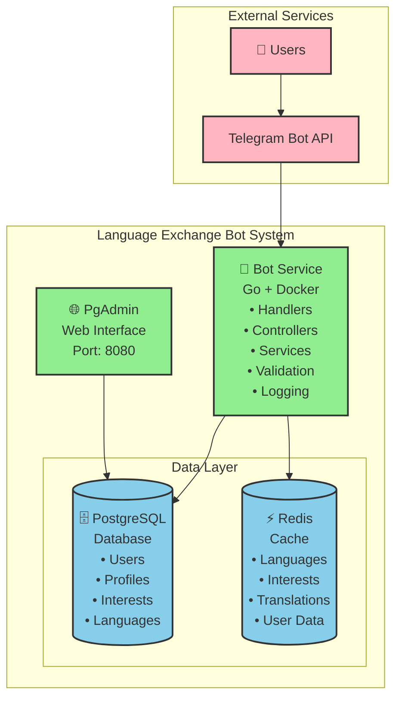

## 🔧 Текущая архитектура (Упрощенная)

### Активные компоненты

#### 🤖 **Bot Service** - Основной сервис

- **Статус**: ✅ Полностью функционален
- **Технологии**: Go, Telegram Bot API, PostgreSQL, Redis
- **Функции**:
  - Обработка сообщений и команд
  - Управление профилями пользователей
  - Система интересов и языков
  - Административные функции
  - Кэширование и оптимизация

#### 🗄️ **PostgreSQL** - База данных

- **Статус**: ✅ Активна
- **Функции**:
  - Хранение пользовательских данных
  - Профили и настройки
  - Интересы и языки
  - Система отзывов

#### ⚡ **Redis** - Кэширование

- **Статус**: ✅ Активен
- **Функции**:
  - Высокопроизводительное кэширование
  - TTL управление
  - Fallback на in-memory кэш
  - Batch Loading оптимизация

#### 🌐 **PgAdmin** - Администрирование БД

- **Статус**: ✅ Активен
- **Порт**: 8080
- **Функции**: Веб-интерфейс для управления базой данных

### Отключенные компоненты (Временно)

#### 🎯 **Matcher Service** - Подбор партнеров

- **Статус**: ⏸️ Временно отключен
- **Причина**: Проблемы с миграциями
- **Планы**: Восстановление в будущих версиях

#### 👤 **Profile Service** - Управление профилями

- **Статус**: ⏸️ Временно отключен
- **Причина**: Проблемы с миграциями
- **Функциональность**: Перенесена в основной Bot Service
- **Новые возможности**: Расширенный профиль с детальной информацией о пользователе, временной доступности и предпочтениях общения

## 🎯 Архитектура новой системы интересов

### Структура данных

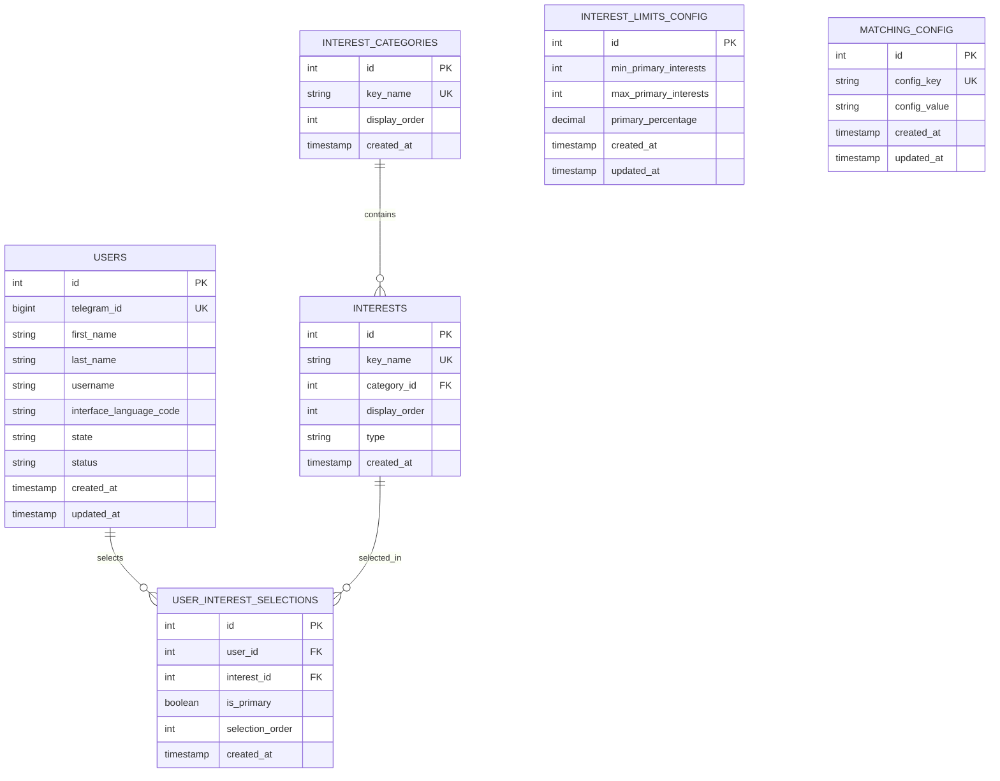

### Поток обработки интересов

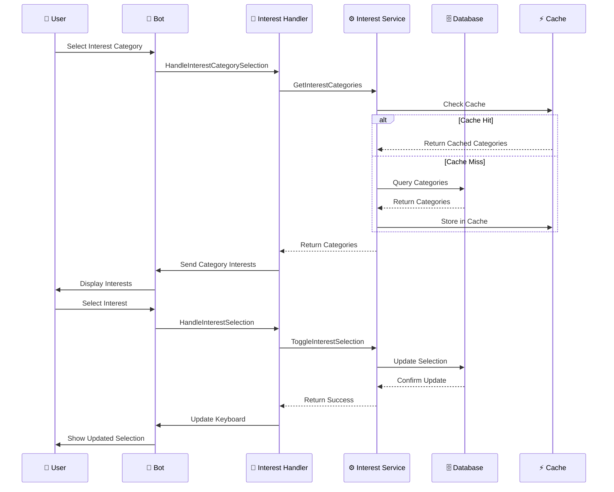

### Компоненты системы

#### 🎯 InterestService

```go
type InterestService struct {
    db     *sql.DB
    config *InterestsConfig
}

// Основные методы
func (s *InterestService) GetInterestCategories() ([]InterestCategory, error)
func (s *InterestService) GetInterestsByCategory(categoryID int) ([]Interest, error)
func (s *InterestService) GetUserInterestSelections(userID int) ([]InterestSelection, error)
func (s *InterestService) AddUserInterestSelection(userID, interestID int, isPrimary bool) error
func (s *InterestService) RemoveUserInterestSelection(userID, interestID int) error
func (s *InterestService) SetPrimaryInterest(userID, interestID int, isPrimary bool) error
func (s *InterestService) GetUserInterestSummary(userID int) (*UserInterestSummary, error)
func (s *InterestService) CalculateCompatibilityScore(user1ID, user2ID int) (int, error)
```

#### 🔧 ProfileInterestHandler

```go
type ProfileInterestHandler struct {
    service         *BotService
    interestService *InterestService
    bot             *BotAPI
    keyboardBuilder *KeyboardBuilder
    errorHandler    *ErrorHandler
}

// Методы для редактирования из профиля
func (h *ProfileInterestHandler) HandleEditInterestsFromProfile(callback *CallbackQuery, user *User) error
func (h *ProfileInterestHandler) HandleEditInterestCategoryFromProfile(callback *CallbackQuery, user *User, categoryKey string) error
func (h *ProfileInterestHandler) HandleEditInterestSelectionFromProfile(callback *CallbackQuery, user *User, interestIDStr string) error
func (h *ProfileInterestHandler) HandleEditPrimaryInterestsFromProfile(callback *CallbackQuery, user *User) error
func (h *ProfileInterestHandler) HandleSaveInterestEditsFromProfile(callback *CallbackQuery, user *User) error
```

#### 💾 TemporaryInterestStorage

```go
type TemporaryInterestStorage struct {
    mu      sync.RWMutex
    storage map[int][]TemporaryInterestSelection
}

// Thread-safe операции
func (s *TemporaryInterestStorage) AddInterest(userID, interestID int, isPrimary bool)
func (s *TemporaryInterestStorage) RemoveInterest(userID, interestID int)
func (s *TemporaryInterestStorage) ToggleInterest(userID, interestID int) bool
func (s *TemporaryInterestStorage) TogglePrimary(userID, interestID int) bool
func (s *TemporaryInterestStorage) SaveToDatabase(userID int, interestService *InterestService) error
```

### Конфигурация системы

#### ⚙️ interests.json

```json
{
  "matching": {
    "primary_interest_score": 3,
    "additional_interest_score": 1,
    "min_compatibility_score": 5,
    "max_matches_per_user": 10
  },
  "interest_limits": {
    "min_primary_interests": 1,
    "max_primary_interests": 5,
    "primary_percentage": 0.3
  },
  "categories": {
    "entertainment": { "display_order": 1, "max_primary_per_category": 2 },
    "education": { "display_order": 2, "max_primary_per_category": 2 },
    "active": { "display_order": 3, "max_primary_per_category": 2 },
    "creative": { "display_order": 4, "max_primary_per_category": 2 },
    "social": { "display_order": 5, "max_primary_per_category": 2 }
  }
}
```

### Алгоритм совместимости

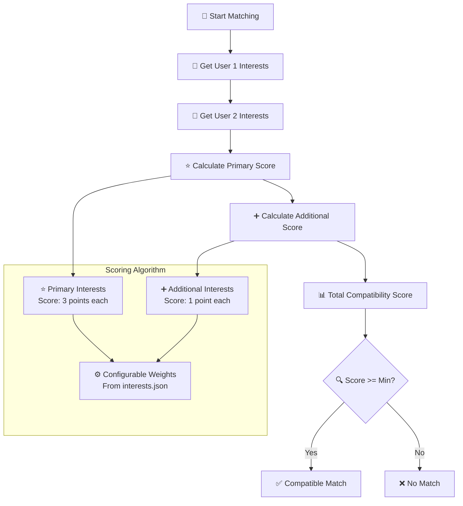

## 🚀 Архитектура кэширования и производительности

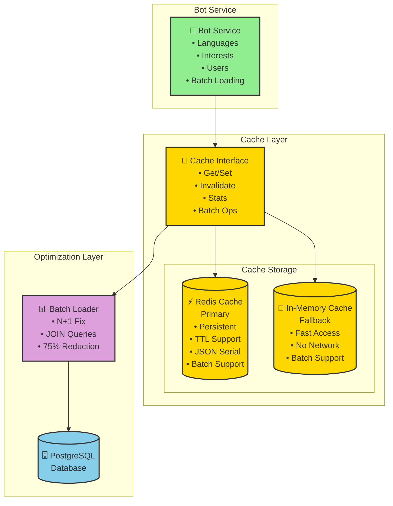

## 🎯 Подробная схема работы системы интересов

### Архитектура компонентов системы интересов

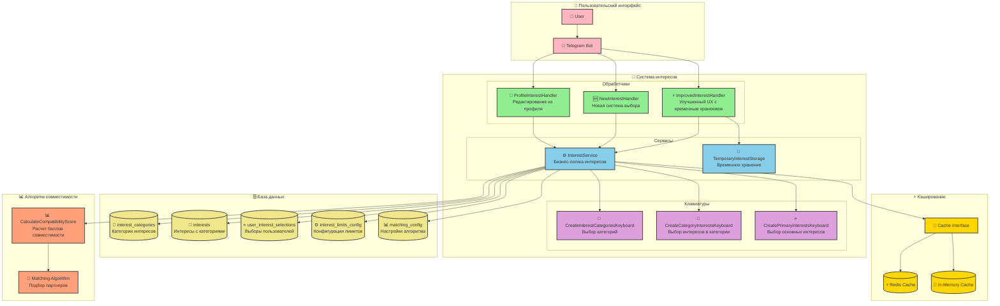

### Детальный поток выбора интересов

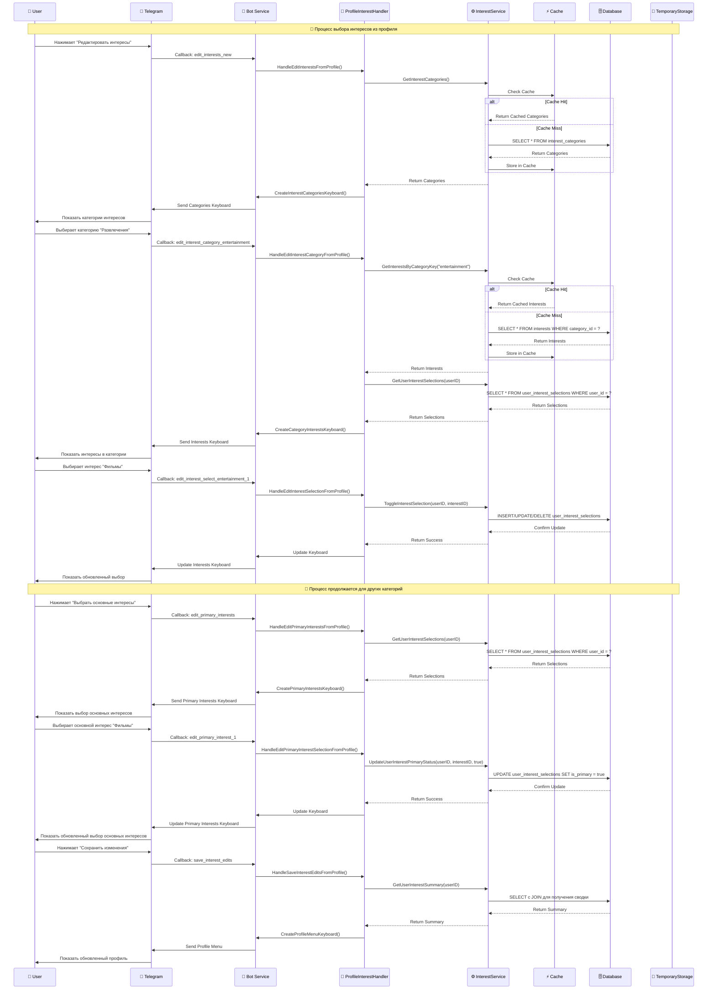

### Алгоритм совместимости и подбора партнеров

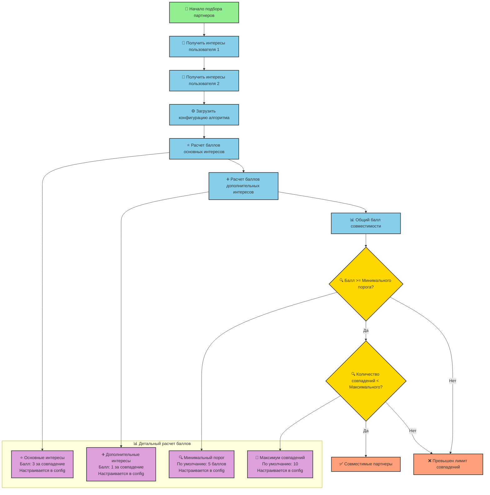

### Временное хранение и улучшенный UX

```mermaid
graph TB
    subgraph "💾 TemporaryInterestStorage"
        TEMP_STORAGE[💾 TemporaryInterestStorage<br/>Thread-safe операции]
        
        subgraph "Операции"
            ADD[➕ AddInterest<br/>Добавить интерес]
            REMOVE[➖ RemoveInterest<br/>Удалить интерес]
            TOGGLE[🔄 ToggleInterest<br/>Переключить выбор]
            TOGGLE_PRIMARY[⭐ TogglePrimary<br/>Переключить основной статус]
            GET_SELECTIONS[📋 GetSelections<br/>Получить выборы]
            SAVE_DB[💾 SaveToDatabase<br/>Сохранить в БД]
        end
        
        subgraph "Thread Safety"
            MUTEX[🔒 sync.RWMutex<br/>Безопасность потоков]
            STORAGE[🗄️ map[int][]TemporaryInterestSelection<br/>Временное хранилище]
        end
    end
    
    subgraph "🔄 Поток данных"
        USER_ACTION[👤 Действие пользователя] --> TEMP_OP[💾 Операция с временным хранилищем]
        TEMP_OP --> UPDATE_UI[🖥️ Обновление интерфейса]
        UPDATE_UI --> USER_CONFIRM{👤 Подтверждение?}
        USER_CONFIRM -->|Да| SAVE_DB
        USER_CONFIRM -->|Нет| CANCEL[❌ Отмена изменений]
        SAVE_DB --> CLEAR_TEMP[🧹 Очистка временного хранилища]
        CANCEL --> CLEAR_TEMP
    end
    
    TEMP_STORAGE --> ADD
    TEMP_STORAGE --> REMOVE
    TEMP_STORAGE --> TOGGLE
    TEMP_STORAGE --> TOGGLE_PRIMARY
    TEMP_STORAGE --> GET_SELECTIONS
    TEMP_STORAGE --> SAVE_DB
    
    ADD --> MUTEX
    REMOVE --> MUTEX
    TOGGLE --> MUTEX
    TOGGLE_PRIMARY --> MUTEX
    GET_SELECTIONS --> MUTEX
    SAVE_DB --> MUTEX
    
    MUTEX --> STORAGE
    
    classDef storage fill:#90EE90,stroke:#333,stroke-width:2px
    classDef operation fill:#87CEEB,stroke:#333,stroke-width:2px
    classDef safety fill:#FFD700,stroke:#333,stroke-width:2px
    classDef flow fill:#DDA0DD,stroke:#333,stroke-width:2px
    classDef decision fill:#FFA07A,stroke:#333,stroke-width:2px
    
    class TEMP_STORAGE storage
    class ADD,REMOVE,TOGGLE,TOGGLE_PRIMARY,GET_SELECTIONS,SAVE_DB operation
    class MUTEX,STORAGE safety
    class USER_ACTION,TEMP_OP,UPDATE_UI,CLEAR_TEMP flow
    class USER_CONFIRM decision
```

## 📊 Потоки данных

### 1. Пользовательский поток

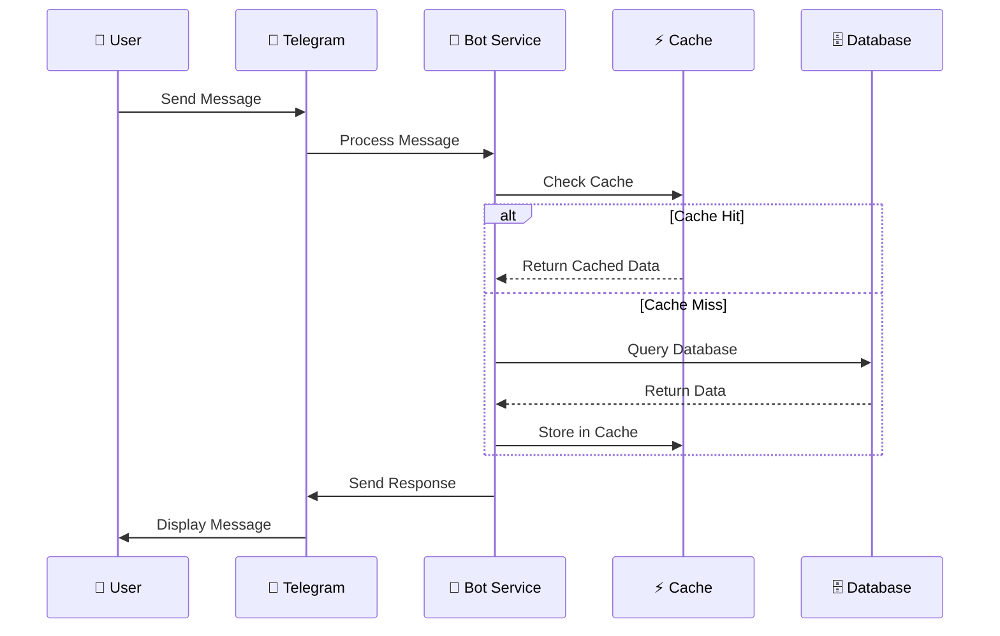

### 2. Административный поток

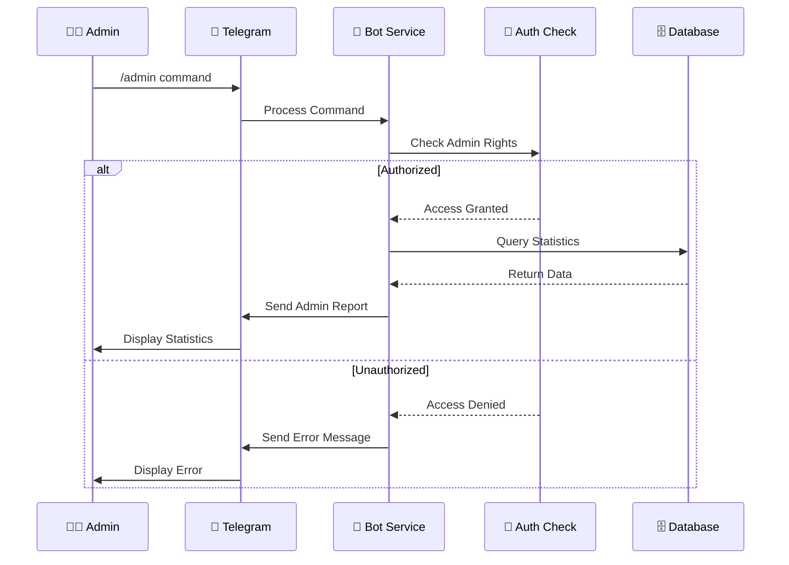

### 3. Система кэширования

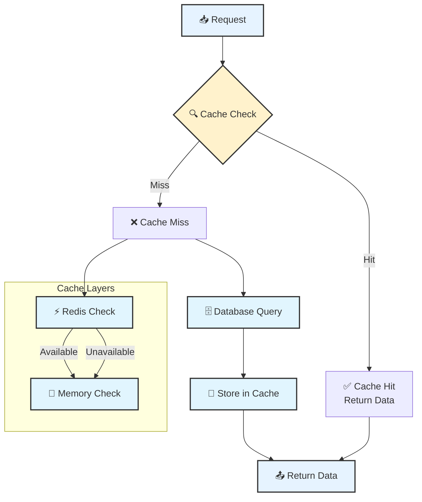

## 🛡️ Система обработки ошибок

### Архитектура обработки ошибок

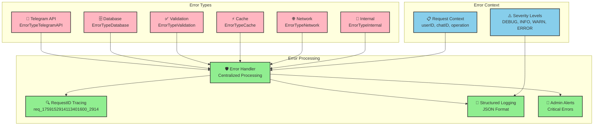

### Типизированные ошибки

```go
ErrorTypeTelegramAPI  // Ошибки Telegram API
ErrorTypeDatabase     // Ошибки базы данных
ErrorTypeValidation   // Ошибки валидации
ErrorTypeCache        // Ошибки кэша
ErrorTypeNetwork      // Сетевые ошибки
ErrorTypeInternal     // Внутренние ошибки
```

### RequestID трейсинг

```go
ctx := errors.NewRequestContext(userID, chatID, "SendMessage")
// RequestID: req_1759152914113401600_2914
```

### Централизованная обработка

```go
return errorHandler.HandleTelegramError(
    err,
    message.Chat.ID,
    int64(user.ID),
    "SendMessage",
)
```

## 📝 Структурированное логирование

### Уровни логирования

- **DEBUG**: Детальная отладочная информация
- **INFO**: Общая информация о работе
- **WARN**: Предупреждения
- **ERROR**: Ошибки

### Специализированные логгеры

- **TelegramLogger**: Сообщения, команды, callback'и
- **DatabaseLogger**: Запросы, транзакции, соединения
- **CacheLogger**: Попадания/промахи кэша, инвалидация
- **ValidationLogger**: Валидация данных

### JSON формат логов

```json
{
  "timestamp": "2025-09-29T20:45:21.903065157+07:00",
  "level": 1,
  "message": "Message received",
  "request_id": "req_123",
  "user_id": 67890,
  "chat_id": 12345,
  "operation": "HandleMessage",
  "component": "telegram",
  "fields": {
    "text_length": 11,
    "has_text": true
  }
}
```

## ✅ Система валидации

### Базовые валидаторы

```go
// Валидация строк
validator.ValidateString("text", []string{"required", "max:50"})

// Валидация Telegram ID
validator.ValidateTelegramID(123456789)

// Валидация кода языка
validator.ValidateLanguageCode("en")

// Валидация состояния пользователя
validator.ValidateUserState("idle")
```

### Специализированные валидаторы

- **UserValidator**: Валидация пользователей и регистрации
- **MessageValidator**: Валидация сообщений и callback'ов
- **ValidationService**: Интеграция с системой ошибок

## 🚀 Развертывание

### Docker Compose архитектура

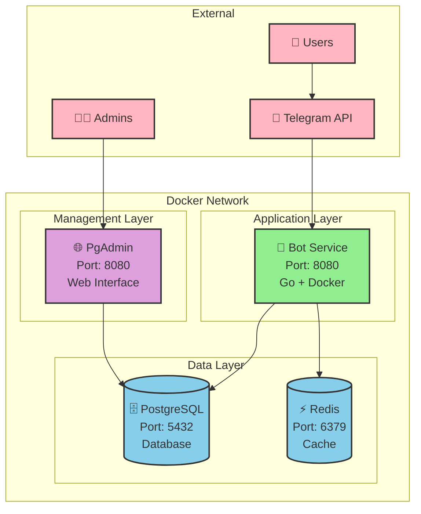

### Docker Compose сервисы

```yaml
services:
  bot:          # Основной Telegram бот
  postgres:     # База данных PostgreSQL
  redis:        # Кэш-сервер Redis
  pgadmin:      # Веб-интерфейс для БД
```

### Порты

- **Bot Service**: 8080 (HTTP API)
- **PostgreSQL**: 5432
- **Redis**: 6379
- **PgAdmin**: 8080 (веб-интерфейс)

### Переменные окружения

- **TELEGRAM_TOKEN**: Токен бота от @BotFather
- **ADMIN_CHAT_IDS**: Chat ID администраторов
- **ADMIN_USERNAMES**: Username администраторов
- **REDIS_URL**: Адрес Redis сервера
- **DATABASE_URL**: Строка подключения к БД

## 🔮 Планы развития

### Roadmap развития системы

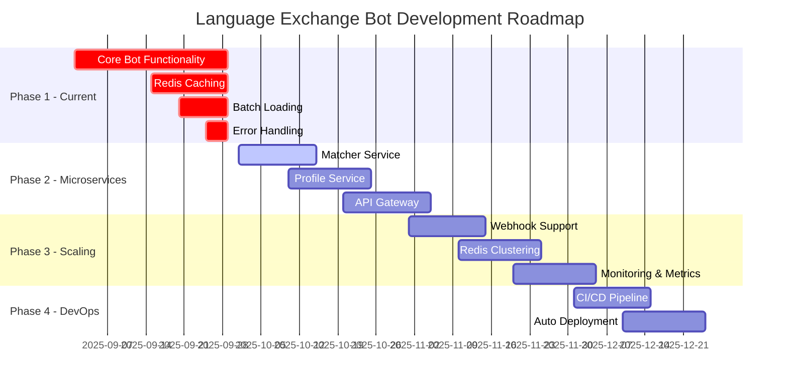

### Архитектура будущего развития

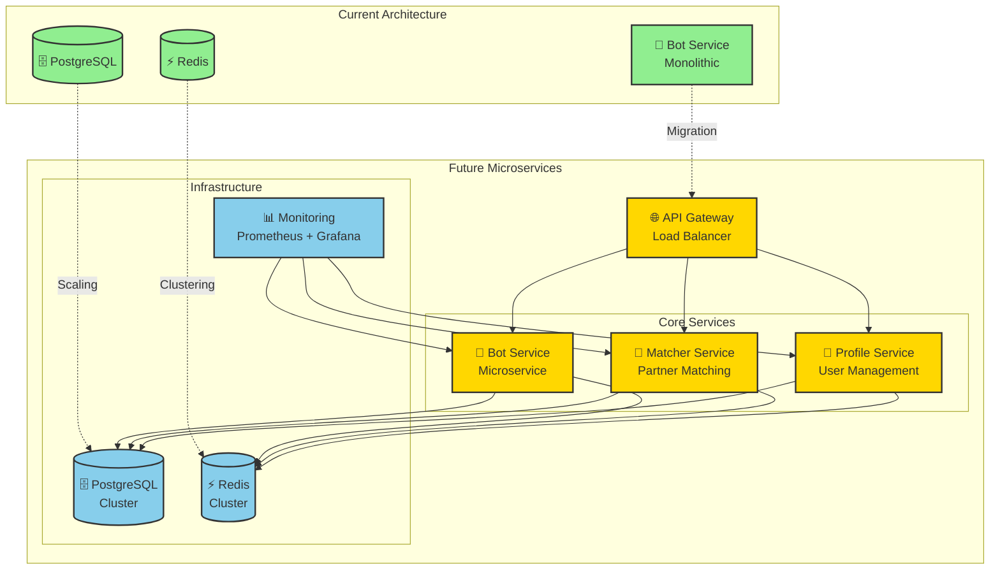

### Восстановление микросервисов

1. **Matcher Service** - алгоритмы подбора партнеров
2. **Profile Service** - выделенное управление профилями
3. **API Gateway** - единая точка входа для микросервисов

### Дополнительные возможности

1. **Webhook поддержка** - для высоконагруженных систем
2. **Кластеризация Redis** - для масштабирования
3. **Мониторинг и метрики** - Prometheus + Grafana
4. **CI/CD пайплайн** - автоматическое развертывание

---

**Статус**: Система готова к продакшену с упрощенной архитектурой. Все критические ошибки исправлены, производительность оптимизирована.
