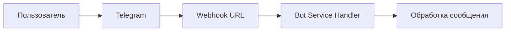

# 🏗️ Language Exchange Bot - Services Architecture

## 📋 Обзор системы

Language Exchange Bot представляет собой микросервисную архитектуру с Telegram ботом в качестве основного интерфейса взаимодействия с пользователями. Система включает несколько сервисов для различных функций.

---

## 🤖 Основные сервисы

### 1. **Bot Service** (Основной сервис)

**Статус:** ✅ **АКТИВЕН** \
**Технологии:** Go, PostgreSQL, Redis, Telegram Bot API \
**Порты:**

- **Admin REST API:** `8080`
- **Swagger UI:** `http://localhost:8080/swagger/`

#### 🎯 Функциональность

- **Основная бизнес-логика** бота
- **Обработка команд и сообщений** от пользователей
- **Управление профилями пользователей**
- **Система интересов и языков**
- **Обработка отзывов и обратной связи**
- **Административные функции**
- **Rate limiting** для защиты от спама
- **Кеширование** (Redis + in-memory)
- **Мониторинг и метрики**

#### 🔗 Доступ к API

```bash
# Swagger документация
http://localhost:8080/swagger/

# Health check
curl http://localhost:8080/healthz

# Readiness check
curl http://localhost:8080/readyz

# Admin API (требует X-Admin-Key)
curl -H "X-Admin-Key: admin-secret-key" \
     http://localhost:8080/api/v1/stats
```

#### 📊 Admin API endpoints

- `GET /api/v1/stats` - Общая статистика системы
- `GET /api/v1/users/{id}` - Информация о пользователе
- `GET /api/v1/users` - Список пользователей с пагинацией
- `GET /api/v1/feedback/unprocessed` - Необработанные отзывы
- `POST /api/v1/feedback/{id}/process` - Обработка отзыва
- `GET /api/v1/rate-limits/stats` - Статистика rate limiting
- `GET /api/v1/cache/stats` - Статистика кеширования

---

### 2. **Profile Service** (Сервис профилей)

**Статус:** ⏸️ **ВРЕМЕННО ОТКЛЮЧЕН** \
**Причина:** Проблемы с миграциями, функциональность перенесена в Bot Service \
**Технологии:** Go, PostgreSQL, gRPC \
**Порт:** `8081` (запланирован)

#### 🎯 Функциональность (запланированная)

- **Управление профилями пользователей**
- **CRUD операции с профилями**
- **Валидация данных профиля**
- **История изменений профиля**

#### 🔄 Статус переноса

Весь функционал профилей **интегрирован в Bot Service** для обеспечения бесперебойной работы.

---

### 3. **Matcher Service** (Сервис подбора партнеров)

**Статус:** ⏸️ **ВРЕМЕННО ОТКЛЮЧЕН** \
**Причина:** Проблемы с миграциями, алгоритм упрощен в Bot Service \
**Технологии:** Go, PostgreSQL, Redis \
**Порт:** `8082` (запланирован)

#### 🎯 Функциональность (запланированная)

- **Алгоритмы подбора партнеров**
- **Расчет совместимости**
- **Управление матчами**
- **Статистика матчинга**

#### 🔄 Статус переноса

Базовый алгоритм подбора **реализован в Bot Service** для обеспечения работы системы.

---

## 🔗 Внешние интеграции

### 4. **Telegram Bot API** (Внешний сервис)

**Статус:** ✅ **АКТИВЕН** \
**Тип:** Webhook (push) \
**URL:** Настраивается через переменные окружения

#### 🎯 Функциональность

- **Получение сообщений** от пользователей
- **Отправка ответов и уведомлений**
- **Обработка callback'ов от inline клавиатур**
- **Управление ботом** через Telegram API

#### 🔗 Взаимодействие



---

### 5. **PostgreSQL Database** (База данных)

**Статус:** ✅ **АКТИВЕН** \
**Порт:** `5432` \
**Тип:** Реляционная БД

#### 🎯 Функциональность

- **Хранение пользовательских данных**
- **Профили, языки, интересы**
- **Отзывы и обратная связь**
- **Статистика и метрики**

#### 🗄️ Основные таблицы

- `users` - Профили пользователей
- `user_languages` - Языки пользователей
- `user_interests` - Интересы пользователей
- `user_feedback` - Отзывы пользователей
- `interests` - Справочник интересов
- `interest_categories` - Категории интересов
- `languages` - Справочник языков

---

### 6. **Redis Cache** (Кеш)

**Статус:** ✅ **АКТИВЕН** \
**Порт:** `6379` \
**Тип:** In-memory key-value store

#### 🎯 Функциональность

- **Кеширование** часто запрашиваемых данных
- **TTL управление** для автоматической инвалидации
- **Распределенное кеширование** для масштабирования
- **Fallback на in-memory** при недоступности Redis

#### 📊 Кешируемые данные

- **Пользователи** (с TTL 15 мин)
- **Интересы** (с TTL 30 мин)
- **Языки** (с TTL 30 мин)
- **Статистика** (с TTL 5 мин)
- **Локализация** (с TTL 30 мин)

---

### 7. **PgAdmin** (Интерфейс управления БД)

**Статус:** ✅ **АКТИВЕН** \
**Порт:** `8080` (в Docker) \
**Тип:** Web-интерфейс

#### 🎯 Функциональность

- **Веб-интерфейс** для управления PostgreSQL
- **Выполнение SQL запросов**
- **Просмотр структуры БД**
- **Экспорт/импорт данных**

#### 🔗 Доступ

```
http://localhost:8080
```

---

## 📊 Мониторинг и метрики

### 8. **Prometheus Metrics** (Метрики)

**Статус:** 🔄 **ПЛАНИРУЕТСЯ** \
**Порт:** `9090` (запланирован)

#### 🎯 Функциональность (запланированная)

- **Сбор метрик** производительности
- **Rate limiting статистика**
- **Cache hit/miss ratios**
- **Database query metrics**
- **Error rates и uptime**

### 9. **Grafana Dashboard** (Визуализация)

**Статус:** 🔄 **ПЛАНИРУЕТСЯ** \
**Порт:** `3000` (запланирован)

#### 🎯 Функциональность (запланированная)

- **Веб-дашборды** для мониторинга
- **Графики производительности**
- **Алерты и уведомления**
- **Исторические данные**

---

## 🏃‍♂️ Запуск сервисов

### Production запуск

```bash
# Все сервисы через Docker Compose
docker-compose up -d

# Или отдельно
make build && make docker-run
```

### Development запуск

```bash
# Bot service с admin API
cd services/bot && go run cmd/bot/main.go

# Отдельные сервисы (когда будут готовы)
cd services/profile && go run cmd/profile/main.go
cd services/matcher && go run cmd/matcher/main.go
```

---

## 🔍 Мониторинг и отладка

### Health Checks

```bash
# Bot service
curl http://localhost:8080/healthz
curl http://localhost:8080/readyz

# Database
curl http://localhost:8080/api/v1/stats

# Redis (через bot service)
curl -H "X-Admin-Key: admin-secret-key" \
     http://localhost:8080/api/v1/cache/stats
```

### Логи

```bash
# Docker logs
docker-compose logs -f bot

# Или через systemd (production)
journalctl -u language-exchange-bot -f
```

### Метрики

```bash
# Rate limiting stats
curl -H "X-Admin-Key: admin-secret-key" \
     http://localhost:8080/api/v1/rate-limits/stats

# Cache stats
curl -H "X-Admin-Key: admin-secret-key" \
     http://localhost:8080/api/v1/cache/stats
```

---

## 📚 Документация

### API Documentation

- **Swagger UI:** `http://localhost:8080/swagger/`
- **Admin API:** `SERVICES.md` (этот файл)
- **gRPC API:** `api/README.md`

### Architecture

- **Общая архитектура:** `ARCHITECTURE.md`
- **Диаграммы:** `ARCHITECTURE_DIAGRAMS_SUMMARY.md`
- **Протоколы:** `api/proto/*.proto`

### Development

- **README:** `README.md`
- **Changelog:** `CHANGELOG.md`
- **Makefile:** `Makefile`

---

## 🚀 Планы развития

### Короткосрочные (ближайшие релизы)

- [ ] Восстановление Profile Service
- [ ] Восстановление Matcher Service
- [ ] Добавление Prometheus метрик
- [ ] Реализация Grafana dashboard

### Долгосрочные

- [ ] Event-driven архитектура
- [ ] Service Mesh (Istio)
- [ ] Multi-region deployment
- [ ] Advanced ML для матчинга

---

## 📞 Контакты

- **Команда:** Language Exchange Bot Team
- **Документация:** <https://github.com/your-org/language-exchange-bot>
- **Support:** <support@language-exchange-bot.com>

---

*Последнее обновление: 2025-10-06* \
*Версия: 3.0.0*
